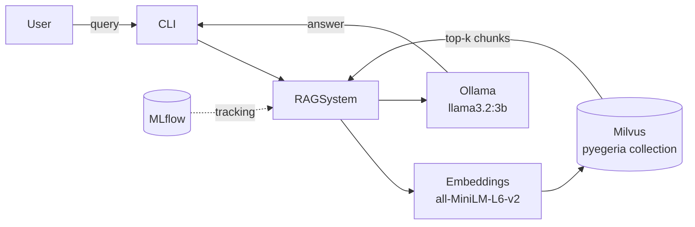
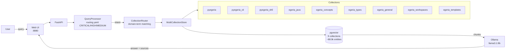
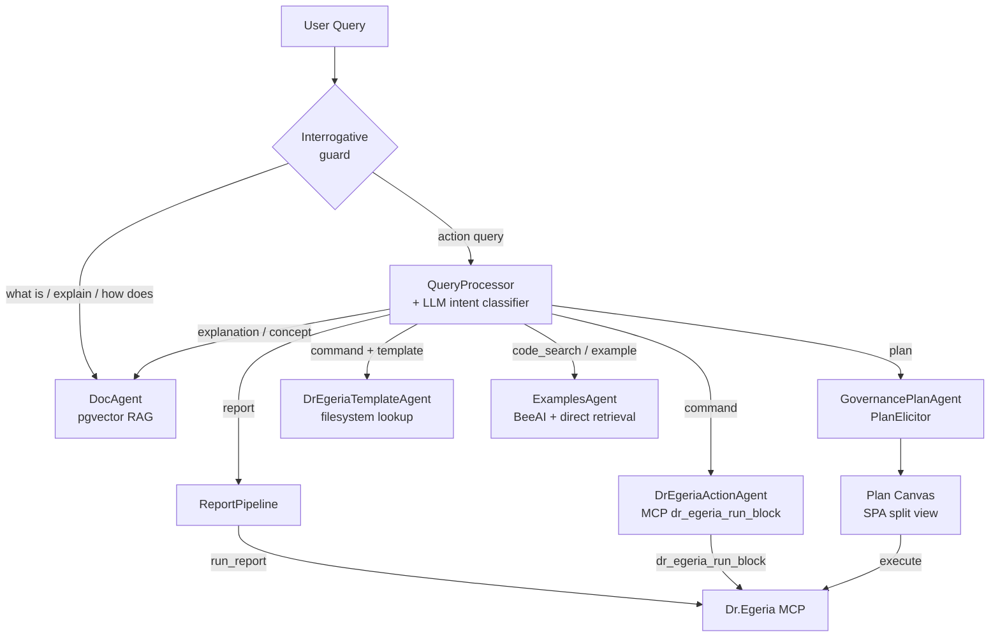
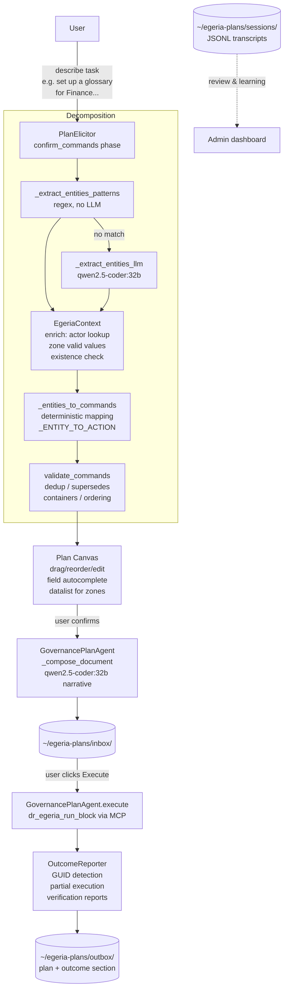

# Egeria Advisor — Project Summary: Phases, Capabilities, Lessons Learned

**Last updated:** 2026-06-15  
**Repository:** `/Users/dwolfson/localGit/egeria-v6/egeria-advisor`  
**GitHub:** `https://github.com/dwolfson/egeria-advisor`

---

## What the system is

A local RAG (Retrieval-Augmented Generation) system that provides intelligent assistance for [Egeria](https://egeria-project.org/) and pyegeria users. It runs entirely locally — Ollama for LLM inference, pgvector (PostgreSQL) for the vector store, sentence-transformers for embeddings. It connects to a live Egeria instance via Dr.Egeria MCP for report queries and command execution.

**Stack:**
- Python 3.12+, FastAPI, pgvector @ `localhost:5442`, Ollama @ `localhost:11434`
- Web UI: single-page app served by FastAPI @ `localhost:8880`
- ~88,900 indexed entities across 9 vector collections
- ~33,000 lines of Python

---

## Phase history

### Phases 1–4: Foundation (Jan–Feb 2026)
- Basic RAG pipeline, single `pyegeria` collection (Milvus backend)
- Ollama integration for local LLM inference (`llama3.2:3b` initially)
- MLflow experiment tracking; sentence-transformer embeddings (384-dim, all-MiniLM-L6-v2)
- Uniform ingestion: 1000-character chunks, 200-character overlap — same parameters for all content

### Phase 4b: Multi-collection infrastructure (Feb 18, 2026)
- First expansion: 3 Python collections introduced (`pyegeria`, `pyegeria_cli`, `pyegeria_drE`), each indexed from a separate source path within egeria-python
- `CollectionMetadata` dataclass in `advisor/collection_config.py` — source repo, paths, domain terms, include/exclude patterns, priority
- `CollectionRouter`: domain-term matching selects which collection(s) to search; weighted result merging (60% score / 25% collection quality / 15% priority)
- Java, docs, and workspaces collections (`egeria_java`, `egeria_docs`, `egeria_workspaces`) designed and registered but disabled — ready for Phase 2

### Phase 5: Agent framework (Feb 2026)
- BeeAI framework integration (later retained only for ConversationAgent)
- Multi-agent architecture established
- Key lesson: BeeAI `FunctionTool` objects have no `.func` attribute — extract implementations into `_raw()` plain functions

### Phase 5b: Phase 2 collections enabled (Feb 19, 2026)
- `egeria_java`, `egeria_docs`, `egeria_workspaces` indexed and enabled — 6 active collections total
- First signs that uniform parameters caused problems: documentation queries hallucinated because chunks were too small to hold a complete concept, and min\_score was too permissive for the broader doc content
- **Key realisation**: different content types need different retrieval behaviour. Code queries benefit from more results (higher top\_k); concept queries need precision (higher min\_score). This drove Phase 7 parameter tuning.

### Phase 6: CLI (Feb 2026)
- `egeria-advisor` CLI with `--interactive` and `--agent` modes
- `hey_egeria` CLI command lookup (`CLICommandAgent`)

### Phase 7: Prompt quality and intent-based routing (Feb–Mar 2026)
- **Problem**: routing accuracy ~60% — OMAS/OMAG/OMRS terms matched both Java code and documentation; "Dr. Egeria" variants weren't matched; substring collisions caused wrong-collection retrievals
- **Fix 1 — Domain term precision**: separated Java-specific terms from documentation terms; added all surface variants for collection names (spaces, hyphens, underscores, periods)
- **Fix 2 — Intent detection**: `CollectionRouter` gained intent keywords (`documentation`, `code`, `example`, `cli`) with priority boosts (+8–15 points) so a query phrased as "show me examples" routes to the examples collection even when the topic matches multiple collections
- **Fix 3 — Intent-classified prompts**: `prompt_templates.py` introduced 5 collection-specific system prompts and 9 query-type-specific instruction blocks — a code query and a concept query now receive different prompts even when routed to the same collection
- **Fix 4 — `routing.yaml`**: pattern-based pre-classifier (CRITICAL / HIGH / MEDIUM priorities) fires before any LLM call, routing obvious cases immediately
- Routing accuracy after fixes: 100% on 14-query test suite (up from ~60%)
- Perspective-aware prompting added: Developer / Data Engineer / Data Steward / Governance Officer — role-specific addendum injected into system prompt

### Phase 7b: Per-collection ingestion parameter tuning (Mar 2, 2026)
- `CollectionMetadata` gained four new fields: `chunk_size`, `chunk_overlap`, `min_score`, `default_top_k`
- Measured hallucination rate at ~80% on documentation queries with uniform 512-token chunks; root cause was chunks too small for tutorials (concept split mid-explanation) and min\_score too low for precise definitions
- **`egeria_docs` split** into three specialised collections, each tuned to its content type:
  - `egeria_concepts` — short concept definitions: chunk 768, overlap 150, min\_score 0.45 (highest in system), top\_k 5
  - `egeria_types` — type schemas and attribute tables: chunk 1024, overlap 200, min\_score 0.42, top\_k 6
  - `egeria_general` — tutorials and guides: chunk 1536, overlap 300, min\_score 0.38, top\_k 8
- Code collections kept at chunk 512 (functions fit naturally), overlap 100, min\_score 0.35, top\_k 10
- Java bumped to chunk 768 (methods are longer than Python functions)
- `egeria_workspaces` matched `egeria_general` parameters (narrative notebook content)
- After split and tuning: documentation hallucination rate fell from ~80% to ~27%
- Mar 8: Python ingestion switched from text chunking to AST-based parsing — functions and classes are now kept intact as natural chunk boundaries; docstrings stay with their methods

### Phase 8: Routing quality (Mar 2026)
- LLM intent classifier (`llm_intent_classifier.py`) introduced for queries that pattern-matching classifies as `general` — zero-temperature LLM call maps to LIVE_DATA / CODE_HELP / CONCEPT / WRITE_COMMAND / AMBIGUOUS
- `CODE_HELP` always maps to `code_search` intent even when the topic is a governance object (e.g. "give me Python to create a project" → ExamplesAgent, not DrEgeriaActionAgent)
- Role-aware routing in `_process_query`: Developer/Data Engineer + code signals → ExamplesAgent; Data Steward/Governance + ambiguous example signals (no Python keyword) → clarification asking whether they want Python code or a Dr.Egeria template
- Domain term conflicts (OMAS/OMAG/OMRS appearing in both code and docs) resolved by moving architecture acronyms to the documentation collections only

### Phase 9: Feedback and examples (Mar 2026)
- Thumbs up/down feedback capture
- ExamplesAgent: runnable Python examples + API reference (method-discovery mode)
- DrEgeriaTemplateAgent: template file lookup

### Phase 10: MCP integration and backend migration (Apr–May 2026)
- **Apr 25: Milvus → pgvector migration** — switched vector backend from Milvus (gRPC, separate process) to PostgreSQL + pgvector extension at `localhost:5442`; HNSW index replaces IVF_FLAT; `ThreadedConnectionPool` for concurrent queries; `_TABLE_NAME_MAP` added to handle collection name normalisation (e.g. `pyegeria_drE` → `pyegeria_dre`)
- **`egeria_templates` collection added** — Dr.Egeria markdown command templates indexed as a ninth collection from `egeria-python/sample-data/templates/`; deliberately tuned differently from all others: chunk 2048 (entire template in one chunk), overlap 0 (each file is self-contained), min\_score 0.30 (lowest in system — intent matching is fuzzy), priority 12 (highest)
- Dr.Egeria MCP server integration (`dr_egeria_run_block`, `run_report`)
- Report pipeline with `QuestionSpecIndex` semantic search over report specs
- DrEgeriaActionAgent: compose and execute multi-field Dr.Egeria commands
- Draggable sidebar resize handles in Web UI
- Admin dashboard with collection health, query metrics, feedback analysis, LGCI analytics

### Phase 11: LGCI — Literate Governance with Context Intelligence (Jun 2026)
See full design: `docs/literate-governance-plan.md`

The major new capability: describe a data management task in plain language → receive a complete, reviewable, executable Plan Document → execute it against Egeria → verified outcome report.

**Key components built:**

| Component | File | What it does |
|---|---|---|
| GovernancePlanAgent | `advisor/agents/governance_plan_agent.py` | Orchestrates the full plan lifecycle |
| PlanElicitor | `advisor/agents/plan_elicitor.py` | Multi-phase conversational Q&A |
| DraftManager | `advisor/governance_draft.py` | Persists in-progress sessions |
| DocumentManager | `advisor/governance_docs.py` | inbox/outbox lifecycle for plans |
| PlanTemplateManager | `advisor/plan_templates.py` | Reusable `{{placeholder}}` templates |
| ActionCatalog | `advisor/action_catalog.py` + `config/dr_egeria_actions.yaml` | 138 Dr.Egeria actions with rules |
| Plan validator | `advisor/plan_validator.py` | Deterministic post-processing rules |
| SessionLogger | `advisor/session_logger.py` | JSONL transcripts per session |
| ArtifactCanvas | `advisor/web/static/artifact_canvas.js` | Generic split-view canvas base |
| PlanCanvas | `advisor/web/static/plan_canvas.js` | Plan-specific canvas adapter |

**Flow:**
```
User describes task
  → PlanElicitor.start() → _decompose_intent (two-stage)
    → _extract_entities_patterns (regex, no LLM for common cases)
    → _extract_entities_llm (qwen2.5-coder:32b fallback)
    → _entities_to_commands (deterministic mapping)
    → validate_commands (dedup, supersedes, containers, ordering)
  → confirm_commands shown in chat + Plan Canvas opens
  → User confirms / adds / removes steps
  → generate → Plan Document saved to inbox
  → Execute → DrEgeriaActionAgent → Dr.Egeria MCP
  → OutcomeReporter → verification reports → outcome section
  → Plan moved to outbox
```

### Phase 11d: Catalog expansion, multi-item extraction, and UX polish (Jun 14, 2026)

#### Action catalog expanded: 55 → 138 entries

`config/dr_egeria_actions.yaml` now covers all Dr.Egeria template families:

| Family | Entries |
|---|---|
| Collections | 15 |
| Data Designer | 15 |
| Digital Product Manager | 11 |
| External Reference | 9 |
| Feedback | 9 |
| Glossary | 10 |
| Governance Officer | 43 |
| Projects | 6 |
| Solution Architect | 13 |
| Actor Manager | 7 |

80+ ordering priority rules added. Previously missing families (Collections, Governance Officer, Data Designer, Digital Product Manager, External Reference, Feedback, Glossary) were added after testing revealed that multi-family plans defaulted to "Create Project" for any unrecognised entity type.

#### Dr.Egeria template routing guard

Added `_DRE_TEMPLATE_SIGNALS` to `rag_system.py`. When the user selects **Show me** intent but their query contains phrases like "dr. egeria template", "egeria template", "markdown command", etc., intent is redirected from `code_search` → `command` before routing fires — so "Show me a Dr.Egeria template to create a collection" correctly returns the template rather than Python code.

#### Pattern-based multi-item list extraction

Added `_MULTI_ENTITY_PATTERN` and `_GEO_PREFIX` class constants to `GovernancePlanAgent`. When the user writes *"solution components for UK Sales DB, EU Sales DB, US Sales DB and WorldWide Sales DB"*, the pattern extractor:

1. Detects the plural entity type + comma-separated name list
2. Splits the names into individual entities
3. Derives a blueprint name from the common suffix of all names (stripping geographic prefixes: UK, EU, US, Canada, WorldWide, etc.) — e.g. → "Sales Forecast Database Blueprint"
4. Generates one `Create Solution Blueprint` + N `Create Solution Component` commands

This runs entirely without LLM involvement. The `_extract_entities_llm` fallback was also extended to handle the full type list (solution_blueprint, solution_component, information_supply_chain, governance_policy, digital_product, etc.) to improve non-list LLM extraction quality.

#### Child-declares-parent pattern — `In Solution Blueprints` pre-fill

The Dr.Egeria pattern for parent-child relationships is: children declare their container at creation time via a Reference Name List field (e.g. `In Solution Blueprints` on `Create Solution Component`). No separate Link command is needed.

`_make_cmd()` now auto-generates a qualified name for every command using the pyegeria convention (`{EgeriaType}::{display-name-with-dashes}`) via `_ACTION_TO_EGERIA_TYPE` (31-entry dict). The blueprint's qualified name is pre-filled into `In Solution Blueprints` on every component command — visible and editable in the Plan Canvas immediately after the confirm step.

#### Unique `_answers_key` for same-action commands

Previously, five `Create Solution Component` commands all shared the same answers dict key, causing the Plan Canvas to display "WorldWide Sales Forecast Database" for all five. Fixed: `_make_cmd` now sets `_answers_key = f"{action}:{display_name}"` — each command gets a unique key regardless of how many share the same action type.

#### "Generate Now" and "Completely Wrong" as buttons

Added `_NAV_CONFIRM = ["generate_now", "completely_wrong", "save_exit", "cancel"]` to `PlanElicitor`. The confirm_commands response now uses this nav list so the Web UI renders four clickable buttons:

| Button | What it does |
|---|---|
| ⚡ Generate Now | Skip Q&A, produce plan immediately; required fields become TODO placeholders |
| ✗ Completely Wrong | Clear proposed steps, ask user to re-describe from scratch |
| 💾 Save & Exit | Save draft, return to normal chat |
| ✕ Cancel | Discard draft |

The "Completely Wrong" path resets phase to `description` and presents a fresh `_clarification_result` with `nav=["back", "cancel"]`.

#### Plan Canvas expand button

The expand/collapse trigger on each command card was a tiny `▾` character. Replaced with a labelled button showing `▾ Fields` with hover background, making it easier to discover and click.

#### User documentation updates

- `docs/user-docs/LITERATE_GOVERNANCE_GUIDE.md` — updated confirm step section with button table; added multi-item type tip with supported patterns table; documented blueprint auto-naming and qualified name override
- `docs/user-docs/QUICK_START.md` — added queries 6 and 7 (single-topic plan, multi-item plan with blueprint); added troubleshooting rows for wrong command type and same-name display bug; added "Restarting the server after a code update" section

#### Commits

| SHA | Summary |
|---|---|
| `690c10a` | Catalog expansion (55 → 138) + Show Me routing fix |
| `f51c0d8` | Solution component routing + completely wrong on first confirm |
| `8ec1ff8` | Multi-item extraction + In Solution Blueprints pre-fill + Generate Now/Completely Wrong buttons |
| `334d55e` | Unique `_answers_key` + qualified name auto-gen + expand button + docs |

---

## Architecture evolution (Mermaid diagrams)

### Phases 1–4: Basic RAG



### Phase 4b–7: Multi-collection + routing



### Phase 8–9: Agent routing



### Phase 10–11: LGCI full lifecycle



### Phase 11c: Plan Editor mode

```mermaid
flowchart LR
    subgraph Entry points
        NL[Natural language\n"Set up a glossary..."] --> Elicitor[PlanElicitor\ndecompose intent]
        Builder["New Plan (Builder)\nknows Dr.Egeria commands"] --> Blank[Blank canvas\nbuilder_mode=true]
        Template[Saved template] --> Fill[Fill placeholders]
    end

    subgraph Command picker
        Blank --> Picker[Command Picker Modal\nsearch + family tabs]
        Picker -->|GET /api/actions| Index[CommandKeywordIndex\n55 catalogued\n~71 from templates\n126 total]
        Index --> Families["Collections / Data Designer\nGovernance Officer / Glossary\nProjects / Solution Architect\nDigital Product Mgr / ..."]
    end

    Elicitor --> Canvas[Plan Canvas]
    Blank --> Canvas
    Fill --> Canvas

    Canvas --> Execute[Same execution path\ndr_egeria_run_block MCP]
```

---

## Current capabilities

### Query / RAG
- **Explain** — conceptual answers from indexed Egeria docs (9 collections, ~88,900 entities)
- **Show me / Code** — runnable Python examples; API reference (ExamplesAgent)
- **Report** — live data from Egeria via MCP report specs (200+ reports)
- **Act** — Dr.Egeria command execution and template lookup
- **Plan** — LGCI multi-step plan generation (see above)
- **Troubleshoot** — debugging guidance

### Web UI (http://localhost:8880)
- Chat with markdown rendering, source citations, 👍/👎 feedback
- Left sidebar: Available Reports (grouped by topic), Plans (inbox/outbox), Active Drafts, Recent Queries
- Role selector (As:) — Anyone / Developer / Data Engineer / Data Steward / Governance
- Intent override (Auto / Explain / Show me / Report / Act / Plan / Troubleshoot)
- **Plan Canvas** — persistent split-view panel alongside chat when a plan is active:
  - Drag-to-reorder command cards
  - Expand cards for field editing (Basic/Advanced toggle)
  - Per-card narrative text (LLM-generated, user-editable)
  - Add / remove steps; Generate Plan / Execute buttons
  - Draggable ew-resize divider between chat and canvas
- Admin dashboard (`/admin`) — collection health, query analytics, feedback, LGCI plan usage

### Planning (LGCI)
- Describe any multi-object task in plain language
- Confirm proposed steps before any field elicitation
- Refine conversationally or directly in canvas (both live and in sync)
- Save/resume drafts between sessions (persisted to `~/egeria-plans/drafts/`)
- Save approved plans as reusable templates
- Execute → outcome reports appended → moved to outbox
- Session transcripts saved to `~/egeria-plans/sessions/` for review and learning

---

## Model routing

| Use case | Model | Why |
|---|---|---|
| RAG Q&A, routing, embeddings context | `llama3.1:8b` | Speed — high-volume path |
| Planning: narrative, refinement, change application | `qwen2.5-coder:32b` | Quality — better instruction following at 32B |
| Code examples, code analysis | `codellama:13b` | Code-focused |
| Embeddings | `sentence-transformers/all-MiniLM-L6-v2` | Fixed, not via Ollama |

Configuration: `config/advisor.yaml` → `llm.models.{query|planning|code}`.  
Planning code calls `get_planning_llm()`, not `get_ollama_client()`.

---

## Key lessons learned

### 1. Local 8B models can't follow complex JSON instructions reliably

Asking llama3.1:8b to emit structured command JSON caused it to:
- Copy example values ("Analysis", "Discovery") instead of extracting the user's text
- Repeat commands 3–4 times
- Hallucinate governance zones and project hierarchies not mentioned by the user

**Fix:** Two-stage extraction — patterns first (no LLM), deterministic mapping second. The LLM only extracts names and entity types; it never decides command structure.

### 2. Deterministic rules beat prompt engineering for structural correctness

Every structural rule embedded in a prompt is a rule that a small model may ignore. Rules that belong in code (dedup, container ordering, self-referential parent IDs) should be in the validator, not the prompt.

**Fix:** `plan_validator.py` with 6 deterministic post-processing rules applied after every decomposition. The validator is the safety net; the prompt is the starting point.

### 3. Generate first, interrogate second

Slot-filling chatbots that ask multiple questions before showing anything have poor completion rates. Users disengage after 3–4 sequential questions.

**Fix:** `confirm_commands` phase — show the proposed steps immediately, let the user react. Only ask for details after the shape of the plan is confirmed.

### 4. Conversation handles structure; canvas handles detail

Structural changes ("add a sub-project", "remove step 3", "move design before requirements") are natural in conversation. Field-level detail (descriptions, dates, owners) is better handled by clicking a field in a visible artifact.

**Fix:** Side-by-side Plan Canvas + chat. Neither forces the user into the other mode.

### 5. Dr.Egeria sub-projects don't use Link Project Hierarchy

Sub-projects are created using `Create Project` with `Parent ID` and `Parent Relationship Type Name = ProjectHierarchy` — a single command. `Link Project Hierarchy` is never needed and was causing validator warnings.

**Fix:** Added to action catalog as a superseded action; validator converts it automatically.

### 6. BeeAI FunctionTool objects have no .func attribute

Calling `my_tool.func(...)` raises `AttributeError`. Extract implementations into `_raw()` functions.

### 7. The action catalog is the right place for structural knowledge

138 Dr.Egeria actions (~126 unique commands across 10 template families) with their ordering priorities, container dependencies, supersedes relationships, and natural-language aliases. This is the system's "learned rules" — structured, inspectable, and evolvable without touching the LLM or prompts. All families are now catalogued. Commands not in the catalog are accessible via the Plan Editor (direct builder) mode through the command keyword index.

### 9. Intent override is a suggestion, not a mandate

Treating intent=Plan as an absolute mandate caused "What is a Dr.Egeria Template?" to enter the planning agent and attempt to create a glossary term for it. A pre-flight interrogative guard fires before intent is applied: `what is`, `how does`, `explain`, `define`, etc. always route to DocAgent regardless of what intent is set.

### 10. Build the action catalog from real use cases, not upfront coverage

The catalog grew to 42 entries by adding entries only when scenarios were tested. This left entire families (Solution Architect, most of Governance Officer) missing. When a user asked "Create a blueprint called X", the system defaulted to "Create Project". The fix requires both a complete command keyword index (built from the template filesystem) and a systematic catalog expansion pass — not just adding entries reactively.

### 8. Model routing significantly improves quality without full model switch

Using a 32B model for narrative generation / refinement while keeping 8B for high-volume Q&A gives much better plan document quality without sacrificing RAG latency.

---

## Architecture overview (current)

```
User (Web UI @ localhost:8880)
  → FastAPI (advisor/web/app.py)
  → RAGSystem (advisor/rag_system.py)
      ├─ Draft routing (draft_id present → PlanElicitor)   [fires first]
      ├─ Template/resume navigation patterns
      ├─ Interrogative guard (what is/how does/explain → DocAgent, overrides intent)
      ├─ QueryProcessor → intent classifier → route to agent/pipeline
      │     └─ if intent override set (plan/command/act) but query is interrogative
      │          → override redirected to 'explanation' before classifier fires
      │
      ├─ plan              → GovernancePlanAgent → PlanElicitor → Plan Canvas
      │     ├─ confirm_commands: restart_signals → fresh description
      │     └─ keyword_suggestions → "Did you mean X?" in confirm
      ├─ report            → ReportPipeline → MCP run_report
      ├─ command (+template) → DrEgeriaTemplateAgent (filesystem)
      ├─ command           → DrEgeriaActionAgent → MCP dr_egeria_run_block
      ├─ code_search/example → ExamplesAgent (BeeAI + direct retrieval)
      ├─ explanation/etc   → DocAgent
      └─ fallback          → RAG retrieval → pgvector → LLM generation

Plan Editor (builder mode):
  POST /api/drafts/builder → blank draft (builder_mode=True)
  GET  /api/actions        → all ~126 commands grouped by family
  → Plan Canvas opens; user searches/picks commands via command picker modal
  → same canvas + execution path as conversational mode
```

**Vector collections (9 active, ~88,900 entities):**
`pyegeria`, `pyegeria_cli`, `pyegeria_drE`, `egeria_java`, `egeria_concepts`,
`egeria_types`, `egeria_general`, `egeria_workspaces`, `egeria_templates`

---

## File structure (key files)

```
advisor/
  rag_system.py              — main orchestrator; interrogative routing guard
  query_processor.py         — pattern-match classifier
  llm_client.py              — OllamaClient + get_planning_llm()
  config.py                  — Pydantic config models
  action_catalog.py          — ActionCatalog (138 actions, all families)
  command_keyword_index.py   — CommandKeywordIndex: all ~126 commands, 4-tier confidence lookup
  plan_validator.py          — validate_commands() — 6 deterministic rules
  governance_draft.py        — DraftManager
  governance_docs.py         — DocumentManager
  plan_templates.py          — PlanTemplateManager
  session_logger.py          — SessionLogger (JSONL transcripts)
  egeria_context.py          — EgeriaContext: live actor/project/zone lookups
  agents/
    governance_plan_agent.py — GovernancePlanAgent (two-stage extraction + keyword index)
    plan_elicitor.py         — PlanElicitor (confirm→generate→refine + restart path)
    dr_egeria_agent.py       — DrEgeriaActionAgent
    dre_template_agent.py    — DrEgeriaTemplateAgent
    examples_agent.py        — ExamplesAgent
    doc_agent.py             — DocAgent
    outcome_reporter.py      — OutcomeReporter (partial execution detection)
  web/
    app.py                   — FastAPI routes (incl. /api/actions, /api/drafts/builder)
    static/
      index.html             — SPA (command picker modal, builder entry)
      plan_canvas.js         — PlanCanvas adapter
      artifact_canvas.js     — ArtifactCanvas base (addItem → command picker)
      plan_editor.js         — Plan Editor (full-document view)
      auth.js                — JWT auth helper
config/
  advisor.yaml               — primary config (llm models, paths, rag params)
  dr_egeria_actions.yaml     — action catalog (138 actions, 10 families)
  governance_report_map.yaml — family → report_spec mapping
  routing.yaml               — query classification patterns
docs/
  literate-governance-plan.md — LGCI design (v5, comprehensive)
  user-docs/
    LITERATE_GOVERNANCE_GUIDE.md — LGCI user guide
    QUICK_START.md               — Getting started
```

---

## Recent work (Jun 2026)

### Phase 11d — Execution quality + Outcome reporting (Jun 15, 2026)

**MCP execution chain debugging and diagnostics** ✓
- Traced `GovernancePlanAgent.execute()` → `DrEgeriaActionAgent.execute()` → `dr_egeria_run_block` MCP tool → `process_markdown_file_structured` → `dispatcher.dispatch_batch` → Egeria REST API
- Identified that the Dr.Egeria MCP subprocess was writing inbox files correctly but no outbox output was produced — root cause was `os.environ["EGERIA_ROOT_PATH"] = "/"` in `mcp_server.py` corrupting the outbox path (`/distribution-hub/dr-egeria-outbox`)
- Confirmed `UniversalExtractor` handles both H1 (`#`) and H2 (`##`) command headers; commands reach the dispatcher correctly
- Discovered `_build_structured_response` defaulted `status` to `"success"` for commands with no registered processor — silent no-op counted as success. (MCP server fix applied upstream.)
- Fixed by user in the Dr.Egeria MCP server; execution now reaches Egeria REST API correctly

**Per-command GUID and Qualified Name in execution results** ✓
- `_build_structured_response` in `mcp_server.py` now emits a `commands_detail` list alongside aggregated counts — each entry includes `step`, `command`, `status`, `guid`, `qualified_name`, `display_name`, `message`
- `_parse_dr_egeria_response` extracts `commands_detail` from the JSON response
- `OutcomeReporter.generate()` uses `commands_detail` directly when available (authoritative); falls back to plan-derived list + structured error matching
- Command Results table in the Outcome section now shows **GUID** and **Qualified Name** columns — the key signal that a creation command actually ran
- GUID fallback: when the `guid` field is empty (auto-derived QN not returned by processor), the GUID is extracted from the processor's message string `"Executed X Y (GUID: …)"`
- **Note column always populated**: link command messages (e.g. "Linked X to Y") are shown in the Note column, not just error messages

**Auto-derived Qualified Names for all command types** ✓
- Added `Create Person Role → PersonRole`, `Create Community → Community`, `Create Actor Profile → ActorProfile`, `Create User Identity → UserIdentity` to `_ACTION_TO_EGERIA_TYPE`
- Plans generated for these types now auto-populate Qualified Name following `Type::display-name` convention, so the processor returns both GUID and QN in the result

**Raw Dr.Egeria output preserved in outbox plan** ✓
- `governance_plan_agent.execute()` now appends a collapsible `## Dr.Egeria Execution Output` section to the outbox plan document containing the full augmented plan markdown
- This preserves all Dr.Egeria output including View Report results and Mermaid diagrams
- `plan_editor.js` listens for `<details>` expand events and re-runs Mermaid when the section is opened
- The `## Outcome` section still shows a filtered `### Execution Results` block (Mermaid diagrams and report tables extracted from the raw output) for immediate visibility

**Outcome reporter overhauled** ✓
- `_parse_command_results` (text-parsing the augmented plan) replaced with `_build_command_results` — builds per-command status from plan command names cross-referenced with structured `validation_errors`/`execution_errors`; MCP only reports failures, so all unlisted commands are marked Success
- `_extract_report_sections()` module-level helper: scans Dr.Egeria output for Mermaid blocks and H2 sections containing tables or GUIDs (report content, creation confirmations); skips plain field-definition sections
- Status line correctly shows "7 of 7 succeeded" from authoritative MCP counts, not text parsing

**Post-generate UX cleanup** ✓
- `_build_post_generate_response` in `plan_elicitor.py`: removed full plan dump from chat, removed "What would you like to do?" and "Back" nav buttons; clean 3-line handoff pointing user to canvas
- `_handle_refine` short-phrase guard: ≤4 words with no change verb → refuse without calling LLM (prevents "execute" in chat from being treated as a modification instruction)
- `_apply_change` dynamic token budget: removed `doc_content[:4000]` truncation; `output_tokens` calculated from `len(doc_content) / 3.5 * 1.2` (min 4000, cap 16000); "do not truncate or summarise" added to prompt

**Execute-in-chat intercept** ✓
- In `rag_system._process_query`, detect execute-intent words ("execute", "run the plan", "go ahead", "do it") before forwarding to `PlanElicitor.continue_draft()`
- Loads the active draft spec to get `doc_id`, calls `GovernancePlanAgent.execute(doc_id)` directly
- Prevents "execute" from being treated as a plan modification instruction that corrupts/truncates the plan document

**Canvas UX improvements** ✓
- Added **Validate** button (sky-blue) to canvas toolbar between Generate Plan and Execute
- Validate button enabled for both inbox and outbox plans
- `plan_editor.js _validatePlanDoc()`: reads `data.validation_errors` + `data.execution_errors` (fixes prior bug reading `data.errors`); shows structured table with Step/Command/Issue columns; always shows raw Dr.Egeria output when validation fails
- `plan_canvas.js onRender`: shows both Validate and Execute buttons when `doc_id` exists

**Sidebar delete and recovery** ✓
- `×` delete button on all inbox/outbox plan rows in sidebar
- `DELETE /api/plans/{doc_id}` endpoint; `DocumentManager.delete()` method
- `↺` outbox recovery button: checks HTTP response, opens Plan Editor after successful recovery
- Outbox sidebar colour changed from amber warning to neutral slate

**Command discovery routing** ✓
- `_COMMAND_DISCOVERY_RE` regex + `_is_command_discovery()` + `_handle_command_discovery()` in `rag_system.py`
- Queries like "what Dr.Egeria commands are about solutions?" → `CommandKeywordIndex.search_by_keyword(topic)` → structured response grouped by family
- Previously routed to DocAgent and answered from documentation with hallucinations

**Feedback admin UI** ✓
- `admin.html` Feedback Review section: filter by vote and triage status; table with Step/Command/Issue columns; inline triage select and comment field; `PATCH /api/feedback/extended/{idx}` endpoint
- `feedbackClick` captures `intent_override` and `response_text` from response metadata

### Phase 11c — Routing fixes + Plan Editor mode (Jun 13, 2026)

**Action catalog gap analysis and expansion** ✓ (commit 4412ff5)
- Identified that the catalog covered only 42 of ~126 unique Dr.Egeria commands — one-third
- Dr.Egeria provides 253 template files in basic/advanced pairs across 12 families; the catalog was built reactively, leaving entire families absent
- Added **Solution Architect** family (13 commands: Create Solution Blueprint, Create Solution Component, Create Solution Role, Create Information Supply Chain, and 9 Link commands) — catalog grows from 42 → 55
- Wired `solution_blueprint`, `solution_component`, `information_supply_chain`, `solution_role` into `_ENTITY_TO_ACTION` and `_infer_type_from_context()` — fixes "blueprint" and "component" defaulting to "Create Project"

**Routing defect fixes** ✓ (commit 4412ff5)
- **Negative routing guard** — `_INTERROGATIVE_PREFIXES` constant + `_is_interrogative()` method in `rag_system.py`; fires before intent override is applied; "What is X?" with intent=Plan now routes to DocAgent instead of entering the plan agent
- **Intent override semantics** — guard priority documented: interrogative check > draft_id routing > intent override > pattern classifier
- **Dr.Egeria Explain routing** (Issue 4) — `routing.yaml` explanation patterns expanded with all "what is a dr egeria template" and "what are dr egeria templates" variants; `egeria_general` and `pyegeria_drE` domain terms extended to include "dr egeria template" keywords so DocAgent selects the right collections
- **Show Me routing** (Issue 5) — "show me a dr egeria template" and related forms added to CRITICAL command patterns in `routing.yaml`; routes to `DrEgeriaTemplateAgent` instead of `ExamplesAgent`

**Command keyword index** ✓ (commit e57625f)
- New `advisor/command_keyword_index.py` — `CommandKeywordIndex` class
- Builds from catalog aliases (0.95 confidence) + catalog command names (0.90) + template filesystem scan of all ~126 commands (0.75) + partial substring matching (0.55)
- `lookup(phrase) → CommandMatch(command, family, confidence, source)` — used in `_infer_type_from_context()` as last resort before defaulting to "project"
- `all_commands()` returns full catalog + uncatalogued templates grouped by family — powers `/api/actions` endpoint
- Replaces the blind `"Create Project"` fallback for unknown entity types

**Confidence-gated clarification** ✓ (commit e57625f)
- Low-confidence entity type inferences (confidence < 0.80) are flagged and threaded through `_decompose_intent()` → `PlanElicitor.start()` → stored in draft spec
- `_build_confirm_commands_response()` surfaces "⚠️ I interpreted **\"X\"** as **Create Solution Blueprint** — if that's not right, describe what you meant" warnings when type was inferred with low confidence

**"Completely wrong" correction path** ✓ (commit e57625f)
- New `restart_signals` block in `_handle_confirm_commands()`: "completely wrong", "totally wrong", "not what I asked", "start over", "misunderstood", etc.
- Clears command list, prompts fresh description — full restart without leaving the draft
- `correction_signals` hint updated to mention "completely wrong" as an option

**Plan Editor mode** ✓ (commit e57625f)
- `POST /api/drafts/builder` — creates blank draft with `builder_mode: True`; bypasses `_decompose_intent()`
- `GET /api/actions` — returns all ~126 commands grouped by family for the picker UI
- "New Plan (Builder)" button in Plans sidebar header
- Builder title modal → creates blank canvas
- **Command picker modal**: search input + family filter tabs + command cards with "Add" button; replaces `prompt()` in `addItem()`; `artifact_canvas.js` opens the picker when available

### Phase 11b — LGCI quality + Egeria integration (Jun 10–11, 2026)

**User Login / Authentication** ✓ (commit 47513aa)
- JWT-based auth (HS256, 8-hour TTL, `PyJWT 2.12.1`)
- Login overlay in Web UI; anonymous RAG mode (knowledge/code/plan generation work without login)
- Auth gates in `rag_system.py` — reports, command execution, and plan execution require active session
- Portal SSO design: shared-secret token exchange via postMessage (iframe) and URL fragment (new tab)
- `advisor/auth.py` + `advisor/web/static/auth.js`; all fetch calls updated with `Auth.getHeaders()`

**Admin transcript viewer** ✓ (commit 0605156)
- `admin.html`: Plan Sessions section — outcome-badged table listing all JSONL sessions
- Transcript modal with failure highlighting: amber for confused system turns ("I wasn't sure…"), red for user correction turns ("I asked to…", "not a project")
- Wired into auto-refresh cycle

**Pattern library expansion** ✓ (commit 0605156)
- `_extract_entities_patterns`: added task, team, agreement, data-sharing-request entity types
- `_ROLE_PATTERNS`: added "have X be the Y" and "role as X" phrasings
- `_NAME_STOP`: stops at spaced dashes and the word "have"
- `_infer_type_from_context`: covers all 9 entity types (including study_project, personal_project, agreement)
- `_ENTITY_TO_ACTION`: added `data_sharing_request` / `data_sharing_agreement` → `Create Agreement`

**Egeria context enrichment for planning** ✓ (commits 6192a66, 85ffcf8)
- New `advisor/egeria_context.py` — `EgeriaContext` wraps ActorManager, ProjectManager, GovernanceOfficer, GlossaryManager; lazy init, graceful offline fallback, per-instance zone cache
- Stage 1b in `_decompose_intent`: resolves person names (e.g. "Tom Tally") to Egeria Actor profile qualified names; injects `Actor Profile Qualified Name` into `Link Person Role Appointment` pre_filled fields
- Existence check: warns when a named project/glossary already exists in Egeria
- Governance zone valid values: `/api/templates/{cmd}/fields` injects live zone names as autocomplete options for zone fields; canvas renders `<datalist>` suggestions
- New `/api/egeria/zones` endpoint

**Partial execution detection** ✓ (commit 1363a44)
- `OutcomeReporter.generate()` now accepts `expected_command_count` (auto-counted from plan's Command Sequence section)
- GUID regex detects object-creation successes even when Dr.Egeria doesn't echo "success"
- Status correctly infers Partial when fewer GUIDs returned or fewer command blocks found than expected
- Outcome header shows "N of M commands processed (K succeeded)"

---

## Current state and next steps (Jun 2026)

**LGCI phases complete:**
- Phase 1 ✓ — canvas, conversational planning, confirm→generate→refine flow
- Phase 2 ✓ — execution, outcome reporter, partial execution detection
- Phase 3 partial — ArtifactCanvas extracted; Report Spec canvas needs design
- Phase 11b ✓ — auth, pattern library, Egeria context enrichment, zone valid values
- Phase 11c ✓ — routing fixes, catalog expansion, keyword index, plan editor
- Phase 11d ✓ — execution quality, GUID/QN in results, raw output preservation, UX fixes

**What's working end-to-end (Jun 15, 2026):**
- Plans generate via conversational Q&A or Plan Editor builder mode
- Execution reaches Dr.Egeria MCP → Egeria REST API; objects created in Egeria confirmed by GUID in output
- Outbox plan shows: structured Outcome with GUID/QN per command + filtered Execution Results (Mermaid diagrams) + collapsible raw Dr.Egeria output
- Validate button works for both inbox and outbox plans
- Command discovery ("what Dr.Egeria commands are about solutions?") routes correctly via keyword index
- Delete, recover, and re-execute flows for inbox/outbox plans

**Planned next (in priority order):**

- **Plan re-execution as first-class workflow** — re-executing an outbox plan is *normal operation*, not error recovery. Current UX uses amber warning colour and "Recover for Editing" label. Changes needed: (1) neutral colour for outbox sidebar entries; (2) two action buttons per outbox entry — ✏ (edit first) and ▶ (re-execute directly); (3) `POST /api/plans/{doc_id}/rerun` endpoint that executes outbox plan without moving to inbox first, appending a new `## Outcome (Run N)` section; (4) Create→Update directive rewriting for idempotent re-execution (`update-if-exists` directive + validator rewrite). See backlog plan for full design.

- **Searchable dropdowns for Dr.Egeria attribute valid value sets** — Plan Canvas renders all attribute fields as free-text inputs. For fields with constrained valid values (`DeployedImplementationType`, `GlossaryTermStatus`, `ProjectStatus`, etc.), show a searchable dropdown with an "other / not listed" escape hatch. Three source types: open-metadata enum (static list in catalog), Egeria valid value set (live lookup via pyegeria), reference data from existing entities (glossary names, zone names — partially done). Design: extend `dr_egeria_actions.yaml` with `valid_values_source` per attribute; new `ValidValueRegistry`; `GET /api/valid-values/{source_key}`; Plan Canvas renders `<select>` with text filter instead of `<input type="text">`. See backlog plan for full design.

- **Egeria Projects & Tasks gaps** — fill specific catalog gaps for the 0130-Projects type system: Update Project, Update Task, Add Project Team Member, Classify Project as Experiment; add `known_fields` (mission, successCriteria, projectStatus, projectHealth, priority, dates) to existing Create actions; routing patterns for project/task listing; report specs for Campaigns, Tasks.

- **Action catalog expansion** — the catalog covers 55 of ~126 unique commands. The remaining ~71 are accessible via the Plan Editor command picker but not through conversational planning. Priority order: Collections (15), remaining Governance Officer Creates (~27), Data Designer (11), Digital Product Manager (8). ⚠️ Verify field names against Dr.Egeria template files before writing entries.

- **Live Glossary Term Lookup** — for `explanation` intent + interrogative phrasing ("what is X?"), call `EgeriaContext.search_glossary_terms(term)` after vector retrieval; prepend live glossary results to context with "From your Egeria glossary:" label; surface matching terms as suggestion chips below the response. Cap timeout at 3 seconds — don't block Q&A.

- **Egeria referenced data for valid field values** — extend `EgeriaContext.find_valid_values(set_name)` for project status, data classification levels, etc.; wire into the fields endpoint for field types beyond governance zones.

- **Egeria Actor lookup for unresolved names** — when `actor_found=False`, optionally auto-insert a `Create Actor Profile` command before the role appointment. Currently surfaces a warning only.

- **Builder mode chat routing** — when `builder_mode: True` is set on a draft, informational chat queries should route to DocAgent rather than GovernancePlanAgent (flag is stored but not yet read by `_process_query`).

- **MCP credential propagation** — investigate whether `run_report`/`dr_egeria_run_block` accept per-call user args; if yes, thread JWT-extracted credentials through to MCP calls.

- **Report Spec canvas** — create/edit question_specs via chat + canvas (needs design session).

- **Few-shot examples from approved plans** — index past approved plans into a new pgvector collection; retrieve similar plans during `_decompose_intent` to improve narrative generation for recurring task types.

- **Plan/report interaction-mode confusion (confirmed root cause, not yet fixed)** — completing one flow (e.g. a report spec / plan draft) and switching to another (e.g. running a pre-built report from the sidebar) can leave the system acting on the previous flow's stale state. Root cause: frontend's single `_activeDraftId` flag (`index.html:428`) is only cleared on `plan`/`plan_executed` responses — the report-run path never clears it — so a stale `draft_id` rides along with a `report` intent_override; backend's `if draft_id:` branch (`rag_system.py:388`) ignores `intent_override` entirely and, worse, the report query text `"run report X"` matches the exec-intent regex on bare `run` (`rag_system.py:430-435`), causing the *previous* draft to be re-executed instead of the requested report running. Full design for the fix (plus the session-scoping work below, which this depends on): `docs/design/SESSION_AND_INTERACTION_STATE.md`.

- **Multi-user considerations — session scoping (superseded by design doc)** — system is currently single-user with zero backend-owned session concept: `DraftManager`/`DocumentManager`/`PlanTemplateManager`/`SessionLogger` are process-wide singletons over one flat shared `~/egeria-plans/` directory; `draft_id` has no user or session scoping (any client that knows/guesses a `draft_id` can act on another user's draft); the JWT's `user_id` is fetched but discarded (`app.py:268-270`, used only as an auth boolean). `user_id` scoping alone is **not sufficient** — demo/shared-account environments run multiple concurrent sessions under the same `user_id`, so two independent scoping dimensions are needed: user-scoped persistent storage (drafts, inbox/outbox, templates, session logs — survives across sessions) vs. session-scoped ephemeral state (active-draft pointer, interaction mode — must not collide across concurrent tabs of the same user). `EgeriaContext`/MCP report agent remain shared-service-account singletons — flagged as a separate, lower-priority follow-on. Full design: `docs/design/SESSION_AND_INTERACTION_STATE.md`.

- **Docker deployment** — four external dependencies (pgvector, Ollama, Dr.Egeria MCP, Egeria). Key: Ollama GPU passthrough is Linux-only; pgvector → `ankane/pgvector` image; Dr.Egeria MCP and Egeria require separate containers or external hosts. A minimal Compose: advisor + pgvector + Ollama (or external Ollama).

- **IntentModel** (deferred) — formal intermediate representation between extraction and command mapping.

---

## How to resume in a new conversation

1. Read `CLAUDE.md` — full maintenance context, design rules (13–19 for LGCI)
2. Read `docs/literate-governance-plan.md` — complete LGCI design including lessons
3. Read `docs/PROJECT_SUMMARY.md` (this document) for overall phase history
4. Run `git log --oneline -10` to see recent commits
5. Start the web UI: `python -m advisor.web.app` → `http://localhost:8880`
