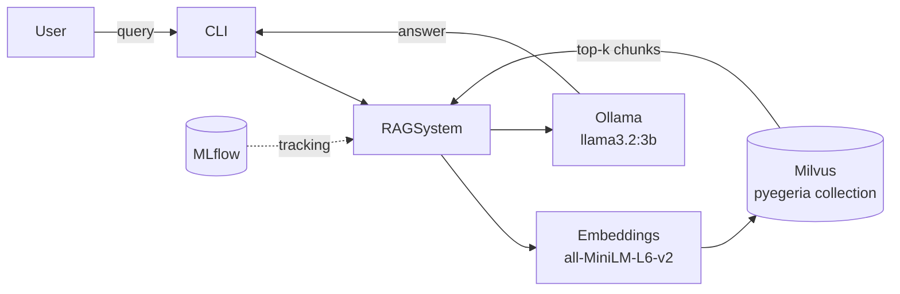
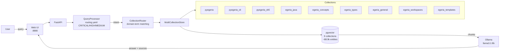
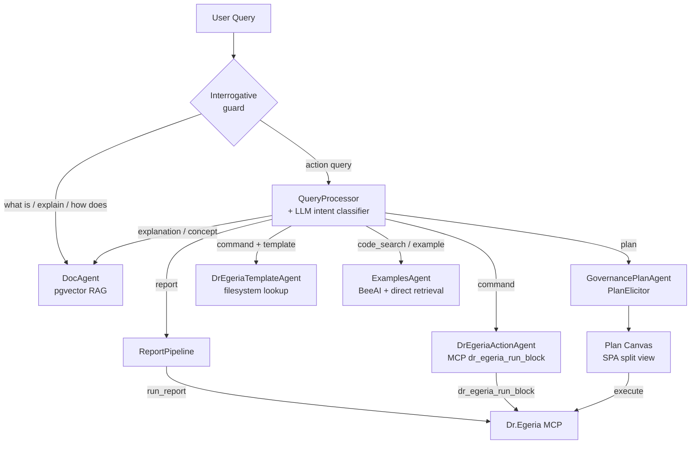
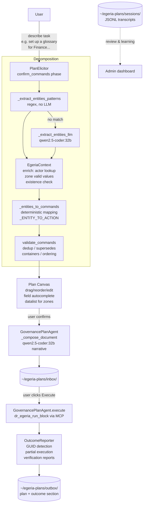

# Egeria Advisor — Project Summary: Phases, Capabilities, Lessons Learned

**Last updated:** 2026-07-11  
**Repository:** `/home/dwolfson/localGit/egeria-v6/egeria-advisor`  
**GitHub:** `https://github.com/dwolfson/egeria-advisor`

---

## What the system is

A local RAG (Retrieval-Augmented Generation) system that provides intelligent assistance for [Egeria](https://egeria-project.org/) and pyegeria users. It runs entirely locally — Ollama for LLM inference, pgvector (PostgreSQL) for the vector store, sentence-transformers for embeddings. It connects to a live Egeria instance via Dr.Egeria MCP for report queries and command execution.

**Stack:**
- Python 3.12+, FastAPI, pgvector @ `localhost:5442`, Ollama @ `localhost:11434`
- Web UI: single-page app served by FastAPI @ `localhost:8880`
- ~92,400 indexed entities across 9 vector collections
- ~33,000 lines of Python

---

## Phase history

### Phases 1–4: Foundation (Jan–Feb 2026)
- Basic RAG pipeline, single `pyegeria` collection (Milvus backend)
- Ollama integration for local LLM inference (`llama3.2:3b` initially)
- MLflow experiment tracking; sentence-transformer embeddings (384-dim, all-MiniLM-L6-v2)
- Uniform ingestion: 1000-character chunks, 200-character overlap — same parameters for all content

### Phase 4b: Multi-collection infrastructure (Feb 18, 2026)
- First expansion: 3 Python collections introduced (`pyegeria`, `pyegeria_cli`, `pyegeria_drE`), each indexed from a separate source path within egeria-python
- `CollectionMetadata` dataclass in `advisor/collection_config.py` — source repo, paths, domain terms, include/exclude patterns, priority
- `CollectionRouter`: domain-term matching selects which collection(s) to search; weighted result merging (60% score / 25% collection quality / 15% priority)
- Java, docs, and workspaces collections (`egeria_java`, `egeria_docs`, `egeria_workspaces`) designed and registered but disabled — ready for Phase 2

### Phase 5: Agent framework (Feb 2026)
- BeeAI framework integration (later retained only for ConversationAgent)
- Multi-agent architecture established
- Key lesson: BeeAI `FunctionTool` objects have no `.func` attribute — extract implementations into `_raw()` plain functions

### Phase 5b: Phase 2 collections enabled (Feb 19, 2026)
- `egeria_java`, `egeria_docs`, `egeria_workspaces` indexed and enabled — 6 active collections total
- First signs that uniform parameters caused problems: documentation queries hallucinated because chunks were too small to hold a complete concept, and min\_score was too permissive for the broader doc content
- **Key realisation**: different content types need different retrieval behaviour. Code queries benefit from more results (higher top\_k); concept queries need precision (higher min\_score). This drove Phase 7 parameter tuning.

### Phase 6: CLI (Feb 2026)
- `egeria-advisor` CLI with `--interactive` and `--agent` modes
- `hey_egeria` CLI command lookup (`CLICommandAgent`)

### Phase 7: Prompt quality and intent-based routing (Feb–Mar 2026)
- **Problem**: routing accuracy ~60% — OMAS/OMAG/OMRS terms matched both Java code and documentation; "Dr. Egeria" variants weren't matched; substring collisions caused wrong-collection retrievals
- **Fix 1 — Domain term precision**: separated Java-specific terms from documentation terms; added all surface variants for collection names (spaces, hyphens, underscores, periods)
- **Fix 2 — Intent detection**: `CollectionRouter` gained intent keywords (`documentation`, `code`, `example`, `cli`) with priority boosts (+8–15 points) so a query phrased as "show me examples" routes to the examples collection even when the topic matches multiple collections
- **Fix 3 — Intent-classified prompts**: `prompt_templates.py` introduced 5 collection-specific system prompts and 9 query-type-specific instruction blocks — a code query and a concept query now receive different prompts even when routed to the same collection
- **Fix 4 — `routing.yaml`**: pattern-based pre-classifier (CRITICAL / HIGH / MEDIUM priorities) fires before any LLM call, routing obvious cases immediately
- Routing accuracy after fixes: 100% on 14-query test suite (up from ~60%)
- Perspective-aware prompting added: Developer / Data Engineer / Data Steward / Governance Officer — role-specific addendum injected into system prompt

### Phase 7b: Per-collection ingestion parameter tuning (Mar 2, 2026)
- `CollectionMetadata` gained four new fields: `chunk_size`, `chunk_overlap`, `min_score`, `default_top_k`
- Measured hallucination rate at ~80% on documentation queries with uniform 512-token chunks; root cause was chunks too small for tutorials (concept split mid-explanation) and min\_score too low for precise definitions
- **`egeria_docs` split** into three specialised collections, each tuned to its content type:
  - `egeria_concepts` — short concept definitions: chunk 768, overlap 150, min\_score 0.45 (highest in system), top\_k 5
  - `egeria_types` — type schemas and attribute tables: chunk 1024, overlap 200, min\_score 0.42, top\_k 6
  - `egeria_general` — tutorials and guides: chunk 1536, overlap 300, min\_score 0.38, top\_k 8
- Code collections kept at chunk 512 (functions fit naturally), overlap 100, min\_score 0.35, top\_k 10
- Java bumped to chunk 768 (methods are longer than Python functions)
- `egeria_workspaces` matched `egeria_general` parameters (narrative notebook content)
- After split and tuning: documentation hallucination rate fell from ~80% to ~27%
- Mar 8: Python ingestion switched from text chunking to AST-based parsing — functions and classes are now kept intact as natural chunk boundaries; docstrings stay with their methods

### Phase 8: Routing quality (Mar 2026)
- LLM intent classifier (`llm_intent_classifier.py`) introduced for queries that pattern-matching classifies as `general` — zero-temperature LLM call maps to LIVE_DATA / CODE_HELP / CONCEPT / WRITE_COMMAND / AMBIGUOUS
- `CODE_HELP` always maps to `code_search` intent even when the topic is a governance object (e.g. "give me Python to create a project" → ExamplesAgent, not DrEgeriaActionAgent)
- Role-aware routing in `_process_query`: Developer/Data Engineer + code signals → ExamplesAgent; Data Steward/Governance + ambiguous example signals (no Python keyword) → clarification asking whether they want Python code or a Dr.Egeria template
- Domain term conflicts (OMAS/OMAG/OMRS appearing in both code and docs) resolved by moving architecture acronyms to the documentation collections only

### Phase 9: Feedback and examples (Mar 2026)
- Thumbs up/down feedback capture
- ExamplesAgent: runnable Python examples + API reference (method-discovery mode)
- DrEgeriaTemplateAgent: template file lookup

### Phase 10: MCP integration and backend migration (Apr–May 2026)
- **Apr 25: Milvus → pgvector migration** — switched vector backend from Milvus (gRPC, separate process) to PostgreSQL + pgvector extension at `localhost:5442`; HNSW index replaces IVF_FLAT; `ThreadedConnectionPool` for concurrent queries; `_TABLE_NAME_MAP` added to handle collection name normalisation (e.g. `pyegeria_drE` → `pyegeria_dre`)
- **`egeria_templates` collection added** — Dr.Egeria markdown command templates indexed as a ninth collection from `egeria-python/sample-data/templates/`; deliberately tuned differently from all others: chunk 2048 (entire template in one chunk), overlap 0 (each file is self-contained), min\_score 0.30 (lowest in system — intent matching is fuzzy), priority 12 (highest)
- Dr.Egeria MCP server integration (`dr_egeria_run_block`, `run_report`)
- Report pipeline with `QuestionSpecIndex` semantic search over report specs
- DrEgeriaActionAgent: compose and execute multi-field Dr.Egeria commands
- Draggable sidebar resize handles in Web UI
- Admin dashboard with collection health, query metrics, feedback analysis, LGCI analytics

### Phase 11: LGCI — Literate Governance with Context Intelligence (Jun 2026)
See full design: `docs/literate-governance-plan.md`

The major new capability: describe a data management task in plain language → receive a complete, reviewable, executable Plan Document → execute it against Egeria → verified outcome report.

**Key components built:**

| Component | File | What it does |
|---|---|---|
| GovernancePlanAgent | `advisor/agents/governance_plan_agent.py` | Orchestrates the full plan lifecycle |
| PlanElicitor | `advisor/agents/plan_elicitor.py` | Multi-phase conversational Q&A |
| DraftManager | `advisor/governance_draft.py` | Persists in-progress sessions |
| DocumentManager | `advisor/governance_docs.py` | inbox/outbox lifecycle for plans |
| PlanTemplateManager | `advisor/plan_templates.py` | Reusable `{{placeholder}}` templates |
| ActionCatalog | `advisor/action_catalog.py` + `config/dr_egeria_actions.yaml` | 138 Dr.Egeria actions with rules |
| Plan validator | `advisor/plan_validator.py` | Deterministic post-processing rules |
| SessionLogger | `advisor/session_logger.py` | JSONL transcripts per session |
| ArtifactCanvas | `advisor/web/static/artifact_canvas.js` | Generic split-view canvas base |
| PlanCanvas | `advisor/web/static/plan_canvas.js` | Plan-specific canvas adapter |

**Flow:**
```
User describes task
  → PlanElicitor.start() → _decompose_intent (two-stage)
    → _extract_entities_patterns (regex, no LLM for common cases)
    → _extract_entities_llm (qwen2.5-coder:32b fallback)
    → _entities_to_commands (deterministic mapping)
    → validate_commands (dedup, supersedes, containers, ordering)
  → confirm_commands shown in chat + Plan Canvas opens
  → User confirms / adds / removes steps
  → generate → Plan Document saved to inbox
  → Execute → DrEgeriaActionAgent → Dr.Egeria MCP
  → OutcomeReporter → verification reports → outcome section
  → Plan moved to outbox
```

### Phase 11d: Catalog expansion, multi-item extraction, and UX polish (Jun 14, 2026)

#### Action catalog expanded: 55 → 138 entries

`config/dr_egeria_actions.yaml` now covers all Dr.Egeria template families:

| Family | Entries |
|---|---|
| Collections | 15 |
| Data Designer | 15 |
| Digital Product Manager | 11 |
| External Reference | 9 |
| Feedback | 9 |
| Glossary | 10 |
| Governance Officer | 43 |
| Projects | 6 |
| Solution Architect | 13 |
| Actor Manager | 7 |

80+ ordering priority rules added. Previously missing families (Collections, Governance Officer, Data Designer, Digital Product Manager, External Reference, Feedback, Glossary) were added after testing revealed that multi-family plans defaulted to "Create Project" for any unrecognised entity type.

#### Dr.Egeria template routing guard

Added `_DRE_TEMPLATE_SIGNALS` to `rag_system.py`. When the user selects **Show me** intent but their query contains phrases like "dr. egeria template", "egeria template", "markdown command", etc., intent is redirected from `code_search` → `command` before routing fires — so "Show me a Dr.Egeria template to create a collection" correctly returns the template rather than Python code.

#### Pattern-based multi-item list extraction

Added `_MULTI_ENTITY_PATTERN` and `_GEO_PREFIX` class constants to `GovernancePlanAgent`. When the user writes *"solution components for UK Sales DB, EU Sales DB, US Sales DB and WorldWide Sales DB"*, the pattern extractor:

1. Detects the plural entity type + comma-separated name list
2. Splits the names into individual entities
3. Derives a blueprint name from the common suffix of all names (stripping geographic prefixes: UK, EU, US, Canada, WorldWide, etc.) — e.g. → "Sales Forecast Database Blueprint"
4. Generates one `Create Solution Blueprint` + N `Create Solution Component` commands

This runs entirely without LLM involvement. The `_extract_entities_llm` fallback was also extended to handle the full type list (solution_blueprint, solution_component, information_supply_chain, governance_policy, digital_product, etc.) to improve non-list LLM extraction quality.

#### Child-declares-parent pattern — `In Solution Blueprints` pre-fill

The Dr.Egeria pattern for parent-child relationships is: children declare their container at creation time via a Reference Name List field (e.g. `In Solution Blueprints` on `Create Solution Component`). No separate Link command is needed.

`_make_cmd()` now auto-generates a qualified name for every command using the pyegeria convention (`{EgeriaType}::{display-name-with-dashes}`) via `_ACTION_TO_EGERIA_TYPE` (31-entry dict). The blueprint's qualified name is pre-filled into `In Solution Blueprints` on every component command — visible and editable in the Plan Canvas immediately after the confirm step.

#### Unique `_answers_key` for same-action commands

Previously, five `Create Solution Component` commands all shared the same answers dict key, causing the Plan Canvas to display "WorldWide Sales Forecast Database" for all five. Fixed: `_make_cmd` now sets `_answers_key = f"{action}:{display_name}"` — each command gets a unique key regardless of how many share the same action type.

#### "Generate Now" and "Completely Wrong" as buttons

Added `_NAV_CONFIRM = ["generate_now", "completely_wrong", "save_exit", "cancel"]` to `PlanElicitor`. The confirm_commands response now uses this nav list so the Web UI renders four clickable buttons:

| Button | What it does |
|---|---|
| ⚡ Generate Now | Skip Q&A, produce plan immediately; required fields become TODO placeholders |
| ✗ Completely Wrong | Clear proposed steps, ask user to re-describe from scratch |
| 💾 Save & Exit | Save draft, return to normal chat |
| ✕ Cancel | Discard draft |

The "Completely Wrong" path resets phase to `description` and presents a fresh `_clarification_result` with `nav=["back", "cancel"]`.

#### Plan Canvas expand button

The expand/collapse trigger on each command card was a tiny `▾` character. Replaced with a labelled button showing `▾ Fields` with hover background, making it easier to discover and click.

#### User documentation updates

- `docs/user-docs/LITERATE_GOVERNANCE_GUIDE.md` — updated confirm step section with button table; added multi-item type tip with supported patterns table; documented blueprint auto-naming and qualified name override
- `docs/user-docs/QUICK_START.md` — added queries 6 and 7 (single-topic plan, multi-item plan with blueprint); added troubleshooting rows for wrong command type and same-name display bug; added "Restarting the server after a code update" section

#### Commits

| SHA | Summary |
|---|---|
| `690c10a` | Catalog expansion (55 → 138) + Show Me routing fix |
| `f51c0d8` | Solution component routing + completely wrong on first confirm |
| `8ec1ff8` | Multi-item extraction + In Solution Blueprints pre-fill + Generate Now/Completely Wrong buttons |
| `334d55e` | Unique `_answers_key` + qualified name auto-gen + expand button + docs |

### Phase 11e — Report Selection & Execution Rework (Jun 17–20, 2026)

**Context:** All three report invocation paths were broken in different ways: (1) sidebar modal never executed because `LIST`/`MERMAID` formats were rejected by a Pydantic literal guard in the MCP server; (2) typing a report name with `intent_override='report'` returned "does not exist" because the pipeline only matched the literal prefix `"run report <name>"`; (3) plain-language chat over-filtered via perspectives/questions as hard gates. The fix widened the MCP contract, added name-first resolution, and converted perspectives/questions from hard gates to soft ranking hints.

**MCP contract widened** ✓ (commit `1e59f0d`)
- `run_report_tool` in pyegeria MCP server: `output_type` Literal widened from `["DICT","JSON","MARKDOWN"]` to the full executable set: `DICT`, `JSON`, `LIST`, `TABLE`, `REPORT`, `REPORT-GRAPH`, `FORM`, `MD`, `MERMAID`, `HTML`, `GRAPH`.
- `MARKDOWN` retained as a friendly alias → `REPORT`. All other formats pass through as-is.
- MCP-side allow-list updated to match.

**Per-spec supported formats in catalog API** ✓
- `/api/reports` enriched with a `formats` map: each spec's supported output types unioned from `formats[].types` (expanding `ALL` to the browser-useful set).
- Non-runnable specs (type=`"survey"` or zero executable formats) filtered from sidebar listing and from name-matching; only specs with at least one runnable format appear.

**Dynamic, spec-aware format picker** ✓ (commit `e16379f`)
- Frontend `runReport(name)` rebuilds `#output-format-select` from the `formats[name]` list delivered by `/api/reports`, defaulting to the most browser-friendly available format (`LIST` → `REPORT` → `DICT`).
- Previous behaviour: hardcoded six options, many of which were invalid for the selected spec.

**Name-first resolution + honest errors** ✓
- `ReportPipeline._resolve_report_name()` extended: strips spaces/hyphens/underscores + lowercases, then also searches `get_report_registry()` aliases and does forgiving substring/fuzzy matching, returning the best candidate.
- `process()` gains a **name-first** step for all paths (not just the `"run report <name>"` prefix): if the query or intent resolves to a known spec with strong confidence, dispatch directly to `_execute_report`; only fall to semantic question matching when no name matches.
- Honest errors surfaced: pyegeria's structured ValueError distinguishes unknown report vs unsupported format; both now reach the user-facing message with distinct text.

**Perspectives & questions as soft hints** ✓
- `QuestionSpecIndex.search()`: perspective filter changed from hard zero-out to a soft additive score boost when the perspective matches. A relevant report is never hidden because the role tag doesn't match.
- Semantic similarity threshold relaxed; name-first path carries exact/near-exact selection so the question-matching layer is a ranking aid only.

**Report discovery queries** ✓ (commit `b9c6485`)
- `_is_report_discovery_query()` + `_handle_report_discovery()` in `rag_system.py`: queries like "what reports are about assets?" or "are there any reports on glossary terms?" are intercepted before RAG and answered from `CommandKeywordIndex`/`QuestionSpecIndex` with a structured grouped response.
- `_REPORT_DISCOVERY_RE` covers are-there, list, show me, find forms; "what dr egeria commands are about X?" covered by a companion handler.
- Previously these queries hallucinated from documentation chunks.

**Commits:**

| SHA | Summary |
|---|---|
| `9b179b9` | Fixes for plans and maybe report execution (pre-rework fixes) |
| `1e59f0d` | Reliable report selection & execution across all three paths |
| `e16379f` | Output format dropdown in report sidebar modal |
| `b9c6485` | Filter non-runnable specs; surface master names; report discovery queries |
| `1989219` | Extend report discovery regex to cover more interrogative forms |
| `1e102e5` | Extend Dr.Egeria command/template discovery to cover are-there, templates, how-do-I |

---

### Phase 11f — UI Artifact Lifecycle Refactoring (Jun 20–22, 2026)

**Theme:** The left sidebar was a cramped stack of three drag-resize panes. Artifact types now each get the full column height via a tab strip, and the Dr.Egeria template flow was redesigned to offer a plan instead of hallucinating Jupyter notebook usage instructions.

**Tabbed left column** ✓ (commit `5c18362`)
- Replaced `#sidebar-reports` / `#sidebar-plans` / `#sidebar-recent` stacked panes (separated by `#resize-reports-plans` and `#resize-plans-recent` drag handles) with a tab bar: **Reports | Plans | Recent**.
- Each tab fills the full sidebar height; only one panel visible at a time.
- `setSidebarTab(name)` function mirrors `setIntent()`; active tab persists to `localStorage['ea_sidebar_tab']`; defaults to `Reports`.
- `initSidebarResize()` (vertical inter-pane handles) deleted; horizontal width resize (`initLeftSidebarResize()`) untouched.
- Auto-switch to Plans tab when a draft is opened or created (one `setSidebarTab('plans')` call at the draft-open/create site).
- All existing render functions (`loadReports()`, `loadPlans()`, `loadDrafts()`, `renderRecent()`) and API endpoints unchanged — purely a layout refactor.

**Dr.Egeria template → plan offer CTA** ✓ (commit `ac636f9`)
- `DrEgeriaTemplateAgent._make_result()` now returns `clarification_type: "plan_offer"` and `original_query` alongside the template markdown.
- Jupyter notebook usage instructions removed from the agent's system prompt and fallback LLM prompt entirely — the agent was inventing steps that don't apply to the Dr.Egeria workflow.
- Frontend `_applyQueryResult()` detects `clarification_type === 'plan_offer'` and calls `renderPlanOffer(originalQuery, wrap)`, which appends a violet CTA bar: "Would you like to create a Dr.Egeria plan using this template?" with **Yes** and **No** buttons. Yes invokes `submitQuery(originalQuery, { intent_override: 'plan' })`; No removes the bar.

**Python-vs-DrEgeria intent clarification** ✓ (commit `b13d6e7`)
- When a user with role Anyone, Data Steward, or Governance Officer asks an ambiguous example query (e.g. "show me how to create a collection") without a Python keyword, the routing layer returns a clarification response with two buttons: **Python example** and **Dr.Egeria template**.
- Each button re-submits with the appropriate `intent_override`, avoiding the previous behaviour of silently picking one path.
- Developer and Data Engineer roles still route directly to ExamplesAgent (no clarification).
- *(Superseded by Phase 17/17b: the clarify is now 3-way — Python / CLI / Dr.Egeria — and applies to every role, including Developer/Data Engineer, unless the query has an explicit format signal.)*

**Interrogative guard fix** ✓ (commit `afe12a5`)
- Removed `'command'` from the interrogative guard's redirect condition. Previously "How do I create a Collection?" with `intent_override='command'` (from the clarification button) was silently redirected to DocAgent instead of DrEgeriaTemplateAgent. The guard now only overrides `plan` and `act` intents for interrogative queries.
- `DrEgeriaTemplateAgent` is safe for informational queries: "how do I" is already a `_template_signals` keyword.

**Admin console fixes** ✓ (commit `1127176`)
- Analysis notes textarea in the admin console no longer auto-refreshes away edits mid-typing (auto-refresh guard added).
- `response_text` captured and stored in feedback records when a thumbs up/down vote is cast — previously only the query and intent were saved, making feedback analysis incomplete.

**Commits:**

| SHA | Summary |
|---|---|
| `5c18362` | Replace stacked sidebar panes with artifact-type tabs (Reports \| Plans \| Recent) |
| `ac636f9` | DrEgeria template response → plan offer CTA instead of Jupyter hallucination |
| `b13d6e7` | Python-vs-DrEgeria intent clarification with buttons for Anyone/Steward/Governance |
| `afe12a5` | Interrogative guard no longer overrides explicit 'command' intent |
| `1127176` | Admin console analysis notes editable; response text captured in feedback |

---

### Phase 11g — Code Intelligence & Symbol Analysis (Jun 22–24, 2026)

**Theme:** Structural questions about the codebase ("how many classes are in pyegeria?", "list methods on AssetManager", "what are the most complex methods in egeria_java?") previously hallucinated from RAG chunks. A SQLite symbol table populated at ingest time now answers them with live SQL — no LLM involvement.

**`CodeSymbolStore`** ✓ (commit `9c7f25f`)
- New file: `advisor/code_symbol_store.py`
- SQLite database at `data/code_symbols.db` (path: `cache_dir.parent / "code_symbols.db"`)
- Schema: `collection`, `file_path`, `language`, `kind` (class/interface/enum/method/function/constructor), `name`, `qualified_name`, `signature`, `docstring`, `parent_class`, `return_type`, `start_line`, `end_line`, `is_private`, `is_async`, `complexity`
- Key methods: `upsert_symbols()`, `clear_collection()`, `collection_summary()`, `count_by_kind()`, `list_classes()`, `methods_for_class()`, `search_symbols()`, `most_complex()`, `largest_classes()`
- `get_symbol_store()` module-level singleton

**Python symbol ingestion** ✓
- `advisor/ingest_to_milvus.py`: after `_ingest_python_file()` processes a `.py` file, the extracted `CodeElement` list is also upserted into `CodeSymbolStore`
- `ingest_directory()` calls `clear_collection()` for Python collections at the start of a full re-index, keeping the symbol table in sync
- Python source uses existing `CodeParser` (AST-based, already used for pgvector ingestion)

**Java symbol extraction** ✓ (commit `3cdd645`)
- New file: `advisor/data_prep/java_symbol_extractor.py`
- `JavaSymbolExtractor` uses tree-sitter (`tree-sitter-java>=0.23.0`, added to `pyproject.toml`) to parse `.java` files
- Extracts: classes, interfaces, enums, records, annotation types, methods, constructors — including nested types
- Javadoc: `_preceding_javadoc()` finds the preceding `block_comment` sibling starting with `/**`
- Cyclomatic complexity: counts `if_statement`, `for_statement`, `enhanced_for_statement`, `while_statement`, `do_statement`, `catch_clause`, `switch_expression`, `conditional_expression` nodes
- `JavaSymbol` dataclass matches the `CodeElement` interface expected by `CodeSymbolStore`
- Lazy parser init: `_get_parser()` caches `_PARSER`/`_LANG` globally; module is importable even without tree-sitter installed
- `ingest_to_milvus.py`: `.java` files trigger text ingest + `_extract_java_symbols()` side-call; `ingest_directory()` clears Java collection symbols at re-index start

**`backfill_code_symbols.py`** ✓
- New script: `scripts/backfill_code_symbols.py`
- Populates the symbol table from already-ingested source repos without re-indexing pgvector
- Resolves Python source from `settings.advisor_data_path`; Java source from `_ADVISOR_ROOT.parent / "egeria"` (sibling repo)
- Supports `--collection <name>` for single-collection backfill or all Python+Java collections by default

**Structural query routing** ✓ (commit `9f6664b`)
- `_STRUCTURAL_QUERY_RE` + `_is_structural_query()` + `_handle_structural_query()` added to `rag_system.py`
- Intercepts queries like "what classes are in pyegeria", "list methods on AssetManager", "most complex methods in egeria_java", "how many classes/functions" before RAG dispatch
- Fires for `quantitative`, `code_search`, `general`, `explanation` query types when no `intent_override` is set
- Returns structured SQL answer from `CodeSymbolStore` directly — no LLM call, no hallucination

**Live SQL answers in `analytics.py`** ✓
- `answer_quantitative_query()` checks `CodeSymbolStore` first for: largest class (before generic "classes in" check), list classes, most complex, class-method lookup (CamelCase-only — prevents false match on collection names), search symbols, collection summary, count by kind
- Helper functions: `_symbol_store()`, `_collection_for_filter()`, `_format_class_list()`, `_format_method_list()`, `_format_symbol_search()`, `_collection_summary_text()`

**Bugs fixed during this work:**
- `collection_summary()` typo: `"class" + "s"` = `"classs"` always showed 0 classes. Fixed with explicit kind map: `{"class": "classes", "function": "functions", "method": "methods"}`.
- `re.IGNORECASE` on class-method regex caused collection names like "pyegeria" to be treated as class names. Fixed: CamelCase requirement (`[A-Z]`) enforced; `IGNORECASE` removed.
- "Largest classes" check was shadowed by "list classes" check (same keyword overlap). Fixed by ordering `largest_classes` before `list_classes`.

**Scale:** backfill of `egeria_java` processed 4,181 `.java` files and wrote ~38,900 symbols.

**Commits:**

| SHA | Summary |
|---|---|
| `9c7f25f` | SQLite code symbol table — queryable code structure at ingest time |
| `9f6664b` | Fix symbol store typo, structural query routing, and regex safety |
| `3cdd645` | Java symbol extraction via tree-sitter for egeria_java collection |

### Phase 12 — Report Spec Builder & Parameter Model (Jun 26, 2026)

**Theme:** Egeria Advisor's report creation and execution lifecycle was redesigned from a one-time execution document model (like plans) to a persistent saved view specification model. Column configuration and execution parameters were integrated into a visual, editable canvas and unified into the three-category parameter model (Content Filters, Shape Defaults, Performance Hints).

**Report Spec Document (RSD) Lifecycle** ✓
- Inbox catalog (`~/egeria-reports/inbox/`) stores persistent report specifications (`.md` files conforming to Egeria command/attribute syntax).
- Executing a report spec generates a timestamped result snapshot in outbox (`~/egeria-reports/outbox/<spec_id>_executed_<timestamp>.md`), keeping the original specification intact in the catalog.
- "Customize/Edit" opens the RSD in the visual canvas. "Rerun" executes the catalog entry as-is.

**Three-Category Parameter Model** ✓
- Grouped report execution configuration into:
  - **Content Filters**: `search_string`, `status_filter` (part of spec identity; determines what data is retrieved).
  - **Shape Defaults**: `sort_field`, `sort_order`, `graph_query_depth`, `include_anchors`, `include_lineage` (determines output layout/depth).
  - **Performance Hints**: `page_size`, `start_from` (operational parameters).
- Merges default parameters with user runtime overrides in a unified JSON query structure.

**Visual Canvas Parameter Panels** ✓
- Added three collapsible details sections (Content Filters, Shape Defaults, Performance Hints) above the drag-and-drop Column cards in `report_spec_canvas.js`.
- Implemented debounced PATCH requests to `/api/reports/drafts/{draft_id}` on any input value change to ensure seamless UI-to-draft synchronization.

**Act Intent Extension & Verb Split** ✓
- Expanded `Act` intent (`rag_system.py`) to support both report pipeline execution (for read verbs SHOW/LIST/FIND/DISPLAY) and Dr.Egeria governance commands (for write verbs CREATE/UPDATE/ASSIGN/DELETE).
- Displays post-run action buttons in the chat response: **Modify spec** (opens canvas with spec parameters pre-populated) and **Run again** (prompts for overrides).

**Create Intent & CreateRouter** ✓
- Created `CreateRouter` (`advisor/agents/create_router.py`) to classify `create` intent queries as a plan request (`PlanElicitor`), a report spec builder request (`ReportSpecElicitor`), or ambiguous (presents a Python/Dr.Egeria button choice).
- Renamed "Report" sidebar button to "Run Report" and "Plan" to "Create" in UI.

**Commits:**

| SHA | Summary |
|---|---|
| `2849d61` | Fixing the spec builder, parser, three-category params, and Create router |


### Phase 12b — Composite Examples Agent ("Show me") (Jun 28, 2026)

**Theme:** Programming help and reference lookups ("Show me") were expanded to provide composite responses. The Examples Agent now programmatically searches for and appends related Dr.Egeria command templates and active report specifications alongside the generated Python code example or class/method reference table.

**Programmatic Multi-Resource Discovery** ✓
- Enriched `ExamplesAgent` (`advisor/agents/examples_agent.py`) to search the local filesystem templates (`_find_dre_template_raw`) and report catalog (`_search_report_specs`) based on the user's query keywords.
- Appends matching Dr.Egeria command templates under `### 📝 Related Dr.Egeria Templates` in fenced code blocks.
- Lists matching catalog report specifications under `### 📊 Related Report Specs` with clickable `file://` scheme links, including auto-extracted descriptions.

**Active Perspective Propagation** ✓
- Propagates resolved user `perspective` (resolved via `PerspectiveRoutingEngine` based on session history and active role) down from RAG routing (`rag_system.py`) to the Examples Agent, allowing role-based template filtering.

**Commits:**

| SHA | Summary |
|---|---|
| `[HEAD]` | Composite Examples Agent, perspective propagation, and unit tests |

---

## Architecture evolution (Mermaid diagrams)

### Phases 1–4: Basic RAG



### Phase 4b–7: Multi-collection + routing



### Phase 8–9: Agent routing



### Phase 10–11: LGCI full lifecycle



### Phase 11c: Plan Editor mode

```mermaid
flowchart LR
    subgraph Entry points
        NL[Natural language\n"Set up a glossary..."] --> Elicitor[PlanElicitor\ndecompose intent]
        Builder["New Plan (Builder)\nknows Dr.Egeria commands"] --> Blank[Blank canvas\nbuilder_mode=true]
        Template[Saved template] --> Fill[Fill placeholders]
    end

    subgraph Command picker
        Blank --> Picker[Command Picker Modal\nsearch + family tabs]
        Picker -->|GET /api/actions| Index[CommandKeywordIndex\n55 catalogued\n~71 from templates\n126 total]
        Index --> Families["Collections / Data Designer\nGovernance Officer / Glossary\nProjects / Solution Architect\nDigital Product Mgr / ..."]
    end

    Elicitor --> Canvas[Plan Canvas]
    Blank --> Canvas
    Fill --> Canvas

    Canvas --> Execute[Same execution path\ndr_egeria_run_block MCP]
```

---

## Current capabilities

### Query / RAG
- **Explain** — conceptual answers from indexed Egeria docs (9 collections, ~92,400 entities)
- **Show me / Code** — runnable Python examples; API reference (ExamplesAgent)
- **Report** — live data from Egeria via MCP report specs (200+ reports); all three invocation paths (sidebar, typed name, plain chat) reliable
- **Act** — Dr.Egeria command execution and template lookup; template responses offer plan CTA
- **Plan** — LGCI multi-step plan generation (see above)
- **Troubleshoot** — debugging guidance
- **Inspect / structural code questions** — "how many classes are in pyegeria?", "list methods on AssetManager", "most complex methods in egeria_java", "does X inherit from Y?" answered via live SQL from the symbol store (no LLM hallucination); dedicated `CodeIntelAgent` (`advisor/agents/code_intel_agent.py`) behind the **Inspect** intent button

### Web UI (http://localhost:8880)
- Chat with markdown rendering, source citations, 👍/👎 feedback
- Left sidebar: tabbed — **Reports** (grouped by topic, spec-specific format picker) | **Plans** (drafts/inbox/outbox) | **Recent Queries**; auto-switches to Plans on plan activity
- Role selector (As:) — Anyone / Developer / Data Engineer / Data Steward / Governance
- Intent override (Auto / Explain / Show me / Inspect / Run Report / Act / Create / Troubleshoot) — "Report" and "Plan" were renamed "Run Report" and "Create" in Phase 12; "Inspect" (→ `CodeIntelAgent`) is a dedicated maintainer-facing button added after Phase 11g's ad-hoc structural-query routing, covering method→class lookup, inheritance checks, class hierarchy, and codebase stats over the SQLite symbol table
- **Plan Canvas** — persistent split-view panel alongside chat when a plan is active:
  - Drag-to-reorder command cards
  - Expand cards for field editing (Basic/Advanced toggle)
  - Per-card narrative text (LLM-generated, user-editable)
  - Add / remove steps; Generate Plan / Execute buttons
  - Draggable ew-resize divider between chat and canvas
- Admin dashboard (`/admin`) — collection health, query analytics, feedback, LGCI plan usage

### Planning (LGCI)
- Describe any multi-object task in plain language
- Confirm proposed steps before any field elicitation
- Refine conversationally or directly in canvas (both live and in sync)
- Save/resume drafts between sessions (persisted to `~/egeria-plans/drafts/`)
- Save approved plans as reusable templates
- Execute → outcome reports appended → moved to outbox
- Session transcripts saved to `~/egeria-plans/sessions/` for review and learning

---

## Model routing

| Use case | Model | Why |
|---|---|---|
| RAG Q&A, routing, embeddings context | `llama3.1:8b` | Speed — high-volume path |
| Planning: narrative, refinement, change application | `qwen2.5-coder:32b` | Quality — better instruction following at 32B |
| Code examples, code analysis | `codellama:13b` | Code-focused |
| Embeddings | `sentence-transformers/all-MiniLM-L6-v2` | Fixed, not via Ollama |

Configuration: `config/advisor.yaml` → `llm.models.{query|planning|code}`.  
Planning code calls `get_planning_llm()`, not `get_ollama_client()`.

---

## Key lessons learned

### 1. Local 8B models can't follow complex JSON instructions reliably

Asking llama3.1:8b to emit structured command JSON caused it to:
- Copy example values ("Analysis", "Discovery") instead of extracting the user's text
- Repeat commands 3–4 times
- Hallucinate governance zones and project hierarchies not mentioned by the user

**Fix:** Two-stage extraction — patterns first (no LLM), deterministic mapping second. The LLM only extracts names and entity types; it never decides command structure.

### 2. Deterministic rules beat prompt engineering for structural correctness

Every structural rule embedded in a prompt is a rule that a small model may ignore. Rules that belong in code (dedup, container ordering, self-referential parent IDs) should be in the validator, not the prompt.

**Fix:** `plan_validator.py` with 6 deterministic post-processing rules applied after every decomposition. The validator is the safety net; the prompt is the starting point.

### 3. Generate first, interrogate second

Slot-filling chatbots that ask multiple questions before showing anything have poor completion rates. Users disengage after 3–4 sequential questions.

**Fix:** `confirm_commands` phase — show the proposed steps immediately, let the user react. Only ask for details after the shape of the plan is confirmed.

### 4. Conversation handles structure; canvas handles detail

Structural changes ("add a sub-project", "remove step 3", "move design before requirements") are natural in conversation. Field-level detail (descriptions, dates, owners) is better handled by clicking a field in a visible artifact.

**Fix:** Side-by-side Plan Canvas + chat. Neither forces the user into the other mode.

### 5. Dr.Egeria sub-projects don't use Link Project Hierarchy

Sub-projects are created using `Create Project` with `Parent ID` and `Parent Relationship Type Name = ProjectHierarchy` — a single command. `Link Project Hierarchy` is never needed and was causing validator warnings.

**Fix:** Added to action catalog as a superseded action; validator converts it automatically.

### 6. BeeAI FunctionTool objects have no .func attribute

Calling `my_tool.func(...)` raises `AttributeError`. Extract implementations into `_raw()` functions.

### 7. The action catalog is the right place for structural knowledge

138 Dr.Egeria actions (~126 unique commands across 10 template families) with their ordering priorities, container dependencies, supersedes relationships, and natural-language aliases. This is the system's "learned rules" — structured, inspectable, and evolvable without touching the LLM or prompts. All families are now catalogued. Commands not in the catalog are accessible via the Plan Editor (direct builder) mode through the command keyword index.

### 9. Intent override is a suggestion, not a mandate

Treating intent=Plan as an absolute mandate caused "What is a Dr.Egeria Template?" to enter the planning agent and attempt to create a glossary term for it. A pre-flight interrogative guard fires before intent is applied: `what is`, `how does`, `explain`, `define`, etc. always route to DocAgent regardless of what intent is set.

### 10. Build the action catalog from real use cases, not upfront coverage

The catalog grew to 42 entries by adding entries only when scenarios were tested. This left entire families (Solution Architect, most of Governance Officer) missing. When a user asked "Create a blueprint called X", the system defaulted to "Create Project". The fix requires both a complete command keyword index (built from the template filesystem) and a systematic catalog expansion pass — not just adding entries reactively.

### 8. Model routing significantly improves quality without full model switch

Using a 32B model for narrative generation / refinement while keeping 8B for high-volume Q&A gives much better plan document quality without sacrificing RAG latency.

### 11. A silent per-file catch-all can hide a systemic ingestion bug indefinitely

`ingest_file()`'s top-level `try/except` logged a warning and returned `(0, 0, [])`
on any error, which is reasonable for a genuinely bad file (syntax error) but also
swallowed a duplicate-id upsert conflict that was dropping every class-containing
Python file's chunks, silently, on every ingestion run since Mar 2026. Because the
bug reproduced the same (wrong) row counts every time, there was no obvious signal
that anything was missing — the numbers looked "stable," not "broken." It only
surfaced when a full reset re-ran ingestion with error output actually being read.

**Fix:** don't let a per-item catch-all fully absorb an error class that indicates a
structural bug (duplicate ids from double-parsing an AST) rather than bad input.
When re-running any bulk ingestion/reset, grep the log for `ERROR` before trusting
the "N files ingested" summary line.

---

## Architecture overview (current)

```
User (Web UI @ localhost:8880)
  → FastAPI (advisor/web/app.py)
  → RAGSystem (advisor/rag_system.py)
      ├─ Draft routing (draft_id present → PlanElicitor)   [fires first]
      ├─ Template/resume navigation patterns
      ├─ Interrogative guard (what is/how does/explain → DocAgent, overrides intent)
      ├─ QueryProcessor → intent classifier → route to agent/pipeline
      │     └─ if intent override set (plan/command/act) but query is interrogative
      │          → override redirected to 'explanation' before classifier fires
      │
      ├─ plan              → GovernancePlanAgent → PlanElicitor → Plan Canvas
      │     ├─ confirm_commands: restart_signals → fresh description
      │     └─ keyword_suggestions → "Did you mean X?" in confirm
      ├─ report            → ReportPipeline → MCP run_report
      ├─ command (+template) → DrEgeriaTemplateAgent (filesystem)
      ├─ command           → DrEgeriaActionAgent → MCP dr_egeria_run_block
      ├─ code_search/example → ExamplesAgent (BeeAI + direct retrieval)
      ├─ explanation/etc   → DocAgent
      └─ fallback          → RAG retrieval → pgvector → LLM generation

Plan Editor (builder mode):
  POST /api/drafts/builder → blank draft (builder_mode=True)
  GET  /api/actions        → all ~126 commands grouped by family
  → Plan Canvas opens; user searches/picks commands via command picker modal
  → same canvas + execution path as conversational mode
```

**Vector collections (9 active, ~92,400 entities):**
`pyegeria`, `pyegeria_cli`, `pyegeria_drE`, `egeria_java`, `egeria_concepts`,
`egeria_types`, `egeria_general`, `egeria_workspaces`, `egeria_templates`

---

## File structure (key files)

```
advisor/
  rag_system.py              — main orchestrator; interrogative routing guard
  query_processor.py         — pattern-match classifier
  llm_client.py              — OllamaClient + get_planning_llm()
  config.py                  — Pydantic config models
  action_catalog.py          — ActionCatalog (138 actions, all families)
  command_keyword_index.py   — CommandKeywordIndex: all ~126 commands, 4-tier confidence lookup
  plan_validator.py          — validate_commands() — 6 deterministic rules
  governance_draft.py        — DraftManager
  governance_docs.py         — DocumentManager
  plan_templates.py          — PlanTemplateManager
  session_logger.py          — SessionLogger (JSONL transcripts)
  egeria_context.py          — EgeriaContext: live actor/project/zone lookups
  code_symbol_store.py       — CodeSymbolStore: SQLite symbol table (data/code_symbols.db)
  agents/
    governance_plan_agent.py — GovernancePlanAgent (two-stage extraction + keyword index)
    plan_elicitor.py         — PlanElicitor (confirm→generate→refine + restart path)
    dr_egeria_agent.py       — DrEgeriaActionAgent
    dre_template_agent.py    — DrEgeriaTemplateAgent
    examples_agent.py        — ExamplesAgent
    doc_agent.py             — DocAgent
    outcome_reporter.py      — OutcomeReporter (partial execution detection)
  data_prep/
    code_parser.py           — CodeParser: Python AST symbol extraction (classes, functions, methods)
    java_symbol_extractor.py — JavaSymbolExtractor: tree-sitter Java symbol extraction
  web/
    app.py                   — FastAPI routes (incl. /api/actions, /api/drafts/builder)
    static/
      index.html             — SPA (command picker modal, builder entry)
      plan_canvas.js         — PlanCanvas adapter
      artifact_canvas.js     — ArtifactCanvas base (addItem → command picker)
      plan_editor.js         — Plan Editor (full-document view)
      auth.js                — JWT auth helper
config/
  advisor.yaml               — primary config (llm models, paths, rag params)
  dr_egeria_actions.yaml     — action catalog (138 actions, 10 families)
  governance_report_map.yaml — family → report_spec mapping
  routing.yaml               — query classification patterns
scripts/
  backfill_code_symbols.py   — Populate symbol table from existing source repos (no pgvector re-index)
  full_reset.sh              — Re-clone all source repos + force re-ingest all collections from one consistent snapshot
  clone_repos.py             — Clone/update the 4 source repos into data/repos/
  ingest_collections.py      — Ingest one/all collections from data/repos/ into pgvector
  count_vectors.py           — Count indexed entities per pgvector collection
  test_end_to_end.py         — E2E test suite
docs/
  literate-governance-plan.md — LGCI design (v5, comprehensive)
  user-docs/
    LITERATE_GOVERNANCE_GUIDE.md — LGCI user guide
    QUICK_START.md               — Getting started
```

---

## Recent work (Jun 2026)

### Live bug-hunt session against a real Egeria/Dr.Egeria backend (Jul 6, 2026)

User began exercising Plan execution end-to-end against a live Dr.Egeria MCP
server, Egeria REST backend, and Postgres — first time these code paths ran
outside synthetic testing. Found and fixed, in order (all detailed in
`BACKLOG.md` as SS-6 through SS-11, all `done`):

- **SS-6** — Plan Canvas was editing a stale draft copy once a document
  already existed (draft endpoint vs. document endpoint were two disconnected
  representations); rewrote Canvas around document mode, added drag-reorder
  to the full-screen Plan Editor (it had none), explicit Save (no more
  silent auto-sync).
- **SS-7** — "Execute" faked a chat message instead of calling a direct
  endpoint; if context-based routing misfired, it silently fell into an
  LLM refinement call with zero console output, looking like a hang. Added
  `POST /api/plans/{doc_id}/execute`, switched all three execute call sites
  (Canvas, full-screen editor, sidebar ▶) to it.
- **SS-8** — the real hang, root-caused live via `py-spy dump` on the user's
  machine: `MCPClient._send_request()` called blocking `stdout.readline()`
  directly inside an `async def`, freezing the event loop thread so
  `asyncio.wait_for()`'s 30s timeout could never fire. Fixed with
  `loop.run_in_executor()`.
- **SS-9** — a crashed Dr.Egeria execution (Postgres ran out of shared
  memory) was reported as full success with all-green commands. The
  plain-text response fallback in `_parse_dr_egeria_response()`
  unconditionally returned `success=True`; added keyword-based failure
  detection (`_PLAIN_TEXT_FAILURE_RE`).
- **SS-10** — resuming a plan from Active Drafts after it had already
  executed produced "Plan document `<id>` not found in inbox" — a draft's
  `doc_id` is set once at generation and never updated when the plan later
  moves to outbox under a new `_executed_<ts>` filename. Added
  `DraftManager.update_doc_id()`, threaded `draft_id` through `execute()`
  and all three frontend execute call sites so the draft stays in sync.
- **SS-11** — "Save as Template" / "Save As" from inside the full-screen
  Plan Editor appeared to do nothing; the confirmation modal was actually
  open and functional but rendered *behind* the opaque, later-in-DOM
  `#plan-editor-overlay` (both used `z-50`). Bumped both modals to `z-[60]`.

Working session pattern established and worth repeating: user reports a
live symptom (often just a hang or a wrong-looking result) → trace the
actual code path rather than guessing → verify the fix with a targeted
test (regex stress test, JS round-trip via `node`, `py_compile`) → sync
with remote (this branch and `main` both had other pushes landing
concurrently — always `git fetch` + check drift + stash/ff-merge/pop before
committing) → push → report back precisely, distinguishing "pre-existing
bug newly exposed by an earlier fix in this same session" from "regression
I just introduced," since several fixes here surfaced previously-unreachable
latent bugs one layer down (SS-6 exposed SS-7's reachability; SS-7 in turn
made the stale-doc_id path in SS-10 reachable for the first time).

Two design requests from this session were captured but only the backend
groundwork exists so far — no dedicated UI:
- "Save As" (no history) — done, uses `DocumentManager.save_as()` +
  `builder-title-modal`.
- "Mark as Template" (named storage) — done, `PlanTemplateManager` +
  `save-as-template-modal`; retrieval is currently chat-only ("start from
  template X"), no browsable template list in the sidebar yet.
- Auto-generated version descriptions — done, `describe_changes()` produces
  informal one-liners embedded as `<!-- version_note: ... -->` per version
  snapshot.
- Explicit Save button (not auto-save) in both chat-driven Canvas and
  full-screen editor — done, `ArtifactCanvas.autoSync: false` + `flush()`.

### Phase 11d — Execution quality + Outcome reporting (Jun 15, 2026)

**MCP execution chain debugging and diagnostics** ✓
- Traced `GovernancePlanAgent.execute()` → `DrEgeriaActionAgent.execute()` → `dr_egeria_run_block` MCP tool → `process_markdown_file_structured` → `dispatcher.dispatch_batch` → Egeria REST API
- Identified that the Dr.Egeria MCP subprocess was writing inbox files correctly but no outbox output was produced — root cause was `os.environ["EGERIA_ROOT_PATH"] = "/"` in `mcp_server.py` corrupting the outbox path (`/distribution-hub/dr-egeria-outbox`)
- Confirmed `UniversalExtractor` handles both H1 (`#`) and H2 (`##`) command headers; commands reach the dispatcher correctly
- Discovered `_build_structured_response` defaulted `status` to `"success"` for commands with no registered processor — silent no-op counted as success. (MCP server fix applied upstream.)
- Fixed by user in the Dr.Egeria MCP server; execution now reaches Egeria REST API correctly

**Per-command GUID and Qualified Name in execution results** ✓
- `_build_structured_response` in `mcp_server.py` now emits a `commands_detail` list alongside aggregated counts — each entry includes `step`, `command`, `status`, `guid`, `qualified_name`, `display_name`, `message`
- `_parse_dr_egeria_response` extracts `commands_detail` from the JSON response
- `OutcomeReporter.generate()` uses `commands_detail` directly when available (authoritative); falls back to plan-derived list + structured error matching
- Command Results table in the Outcome section now shows **GUID** and **Qualified Name** columns — the key signal that a creation command actually ran
- GUID fallback: when the `guid` field is empty (auto-derived QN not returned by processor), the GUID is extracted from the processor's message string `"Executed X Y (GUID: …)"`
- **Note column always populated**: link command messages (e.g. "Linked X to Y") are shown in the Note column, not just error messages

**Auto-derived Qualified Names for all command types** ✓
- Added `Create Person Role → PersonRole`, `Create Community → Community`, `Create Actor Profile → ActorProfile`, `Create User Identity → UserIdentity` to `_ACTION_TO_EGERIA_TYPE`
- Plans generated for these types now auto-populate Qualified Name following `Type::display-name` convention, so the processor returns both GUID and QN in the result

**Raw Dr.Egeria output preserved in outbox plan** ✓
- `governance_plan_agent.execute()` now appends a collapsible `## Dr.Egeria Execution Output` section to the outbox plan document containing the full augmented plan markdown
- This preserves all Dr.Egeria output including View Report results and Mermaid diagrams
- `plan_editor.js` listens for `<details>` expand events and re-runs Mermaid when the section is opened
- The `## Outcome` section still shows a filtered `### Execution Results` block (Mermaid diagrams and report tables extracted from the raw output) for immediate visibility

**Outcome reporter overhauled** ✓
- `_parse_command_results` (text-parsing the augmented plan) replaced with `_build_command_results` — builds per-command status from plan command names cross-referenced with structured `validation_errors`/`execution_errors`; MCP only reports failures, so all unlisted commands are marked Success
- `_extract_report_sections()` module-level helper: scans Dr.Egeria output for Mermaid blocks and H2 sections containing tables or GUIDs (report content, creation confirmations); skips plain field-definition sections
- Status line correctly shows "7 of 7 succeeded" from authoritative MCP counts, not text parsing

**Post-generate UX cleanup** ✓
- `_build_post_generate_response` in `plan_elicitor.py`: removed full plan dump from chat, removed "What would you like to do?" and "Back" nav buttons; clean 3-line handoff pointing user to canvas
- `_handle_refine` short-phrase guard: ≤4 words with no change verb → refuse without calling LLM (prevents "execute" in chat from being treated as a modification instruction)
- `_apply_change` dynamic token budget: removed `doc_content[:4000]` truncation; `output_tokens` calculated from `len(doc_content) / 3.5 * 1.2` (min 4000, cap 16000); "do not truncate or summarise" added to prompt

**Execute-in-chat intercept** ✓
- In `rag_system._process_query`, detect execute-intent words ("execute", "run the plan", "go ahead", "do it") before forwarding to `PlanElicitor.continue_draft()`
- Loads the active draft spec to get `doc_id`, calls `GovernancePlanAgent.execute(doc_id)` directly
- Prevents "execute" from being treated as a plan modification instruction that corrupts/truncates the plan document

**Canvas UX improvements** ✓
- Added **Validate** button (sky-blue) to canvas toolbar between Generate Plan and Execute
- Validate button enabled for both inbox and outbox plans
- `plan_editor.js _validatePlanDoc()`: reads `data.validation_errors` + `data.execution_errors` (fixes prior bug reading `data.errors`); shows structured table with Step/Command/Issue columns; always shows raw Dr.Egeria output when validation fails
- `plan_canvas.js onRender`: shows both Validate and Execute buttons when `doc_id` exists

**Sidebar delete and recovery** ✓
- `×` delete button on all inbox/outbox plan rows in sidebar
- `DELETE /api/plans/{doc_id}` endpoint; `DocumentManager.delete()` method
- `↺` outbox recovery button: checks HTTP response, opens Plan Editor after successful recovery
- Outbox sidebar colour changed from amber warning to neutral slate

**Command discovery routing** ✓
- `_COMMAND_DISCOVERY_RE` regex + `_is_command_discovery()` + `_handle_command_discovery()` in `rag_system.py`
- Queries like "what Dr.Egeria commands are about solutions?" → `CommandKeywordIndex.search_by_keyword(topic)` → structured response grouped by family
- Previously routed to DocAgent and answered from documentation with hallucinations

**Feedback admin UI** ✓
- `admin.html` Feedback Review section: filter by vote and triage status; table with Step/Command/Issue columns; inline triage select and comment field; `PATCH /api/feedback/extended/{idx}` endpoint
- `feedbackClick` captures `intent_override` and `response_text` from response metadata

### Phase 11c — Routing fixes + Plan Editor mode (Jun 13, 2026)

**Action catalog gap analysis and expansion** ✓ (commit 4412ff5)
- Identified that the catalog covered only 42 of ~126 unique Dr.Egeria commands — one-third
- Dr.Egeria provides 253 template files in basic/advanced pairs across 12 families; the catalog was built reactively, leaving entire families absent
- Added **Solution Architect** family (13 commands: Create Solution Blueprint, Create Solution Component, Create Solution Role, Create Information Supply Chain, and 9 Link commands) — catalog grows from 42 → 55
- Wired `solution_blueprint`, `solution_component`, `information_supply_chain`, `solution_role` into `_ENTITY_TO_ACTION` and `_infer_type_from_context()` — fixes "blueprint" and "component" defaulting to "Create Project"

**Routing defect fixes** ✓ (commit 4412ff5)
- **Negative routing guard** — `_INTERROGATIVE_PREFIXES` constant + `_is_interrogative()` method in `rag_system.py`; fires before intent override is applied; "What is X?" with intent=Plan now routes to DocAgent instead of entering the plan agent
- **Intent override semantics** — guard priority documented: interrogative check > draft_id routing > intent override > pattern classifier
- **Dr.Egeria Explain routing** (Issue 4) — `routing.yaml` explanation patterns expanded with all "what is a dr egeria template" and "what are dr egeria templates" variants; `egeria_general` and `pyegeria_drE` domain terms extended to include "dr egeria template" keywords so DocAgent selects the right collections
- **Show Me routing** (Issue 5) — "show me a dr egeria template" and related forms added to CRITICAL command patterns in `routing.yaml`; routes to `DrEgeriaTemplateAgent` instead of `ExamplesAgent`

**Command keyword index** ✓ (commit e57625f)
- New `advisor/command_keyword_index.py` — `CommandKeywordIndex` class
- Builds from catalog aliases (0.95 confidence) + catalog command names (0.90) + template filesystem scan of all ~126 commands (0.75) + partial substring matching (0.55)
- `lookup(phrase) → CommandMatch(command, family, confidence, source)` — used in `_infer_type_from_context()` as last resort before defaulting to "project"
- `all_commands()` returns full catalog + uncatalogued templates grouped by family — powers `/api/actions` endpoint
- Replaces the blind `"Create Project"` fallback for unknown entity types

**Confidence-gated clarification** ✓ (commit e57625f)
- Low-confidence entity type inferences (confidence < 0.80) are flagged and threaded through `_decompose_intent()` → `PlanElicitor.start()` → stored in draft spec
- `_build_confirm_commands_response()` surfaces "⚠️ I interpreted **\"X\"** as **Create Solution Blueprint** — if that's not right, describe what you meant" warnings when type was inferred with low confidence

**"Completely wrong" correction path** ✓ (commit e57625f)
- New `restart_signals` block in `_handle_confirm_commands()`: "completely wrong", "totally wrong", "not what I asked", "start over", "misunderstood", etc.
- Clears command list, prompts fresh description — full restart without leaving the draft
- `correction_signals` hint updated to mention "completely wrong" as an option

**Plan Editor mode** ✓ (commit e57625f)
- `POST /api/drafts/builder` — creates blank draft with `builder_mode: True`; bypasses `_decompose_intent()`
- `GET /api/actions` — returns all ~126 commands grouped by family for the picker UI
- "New Plan (Builder)" button in Plans sidebar header
- Builder title modal → creates blank canvas
- **Command picker modal**: search input + family filter tabs + command cards with "Add" button; replaces `prompt()` in `addItem()`; `artifact_canvas.js` opens the picker when available

### Phase 11b — LGCI quality + Egeria integration (Jun 10–11, 2026)

**User Login / Authentication** ✓ (commit 47513aa)
- JWT-based auth (HS256, 8-hour TTL, `PyJWT 2.12.1`)
- Login overlay in Web UI; anonymous RAG mode (knowledge/code/plan generation work without login)
- Auth gates in `rag_system.py` — reports, command execution, and plan execution require active session
- Portal SSO design: shared-secret token exchange via postMessage (iframe) and URL fragment (new tab)
- `advisor/auth.py` + `advisor/web/static/auth.js`; all fetch calls updated with `Auth.getHeaders()`

**Admin transcript viewer** ✓ (commit 0605156)
- `admin.html`: Plan Sessions section — outcome-badged table listing all JSONL sessions
- Transcript modal with failure highlighting: amber for confused system turns ("I wasn't sure…"), red for user correction turns ("I asked to…", "not a project")
- Wired into auto-refresh cycle

**Pattern library expansion** ✓ (commit 0605156)
- `_extract_entities_patterns`: added task, team, agreement, data-sharing-request entity types
- `_ROLE_PATTERNS`: added "have X be the Y" and "role as X" phrasings
- `_NAME_STOP`: stops at spaced dashes and the word "have"
- `_infer_type_from_context`: covers all 9 entity types (including study_project, personal_project, agreement)
- `_ENTITY_TO_ACTION`: added `data_sharing_request` / `data_sharing_agreement` → `Create Agreement`

**Egeria context enrichment for planning** ✓ (commits 6192a66, 85ffcf8)
- New `advisor/egeria_context.py` — `EgeriaContext` wraps ActorManager, ProjectManager, GovernanceOfficer, GlossaryManager; lazy init, graceful offline fallback, per-instance zone cache
- Stage 1b in `_decompose_intent`: resolves person names (e.g. "Tom Tally") to Egeria Actor profile qualified names; injects `Actor Profile Qualified Name` into `Link Person Role Appointment` pre_filled fields
- Existence check: warns when a named project/glossary already exists in Egeria
- Governance zone valid values: `/api/templates/{cmd}/fields` injects live zone names as autocomplete options for zone fields; canvas renders `<datalist>` suggestions
- New `/api/egeria/zones` endpoint

**Partial execution detection** ✓ (commit 1363a44)
- `OutcomeReporter.generate()` now accepts `expected_command_count` (auto-counted from plan's Command Sequence section)
- GUID regex detects object-creation successes even when Dr.Egeria doesn't echo "success"
- Status correctly infers Partial when fewer GUIDs returned or fewer command blocks found than expected
- Outcome header shows "N of M commands processed (K succeeded)"

### Phase 13 — Plan Templates sidebar + NL reorder/relationship editing (Jul 6, 2026)

**Plan Templates sidebar** ✓ (commit 775f319)
- Closes the gap flagged in Phase 12b's next-steps: template retrieval was chat-only
- Scrollable "Plan Templates" sub-section under the existing **Plans** tab (not a new top-level
  tab — there are many other kinds of templates in this project, so it stays scoped)
- Lists `PlanTemplateManager.list_templates()`; one-click "start from this template" (reuses the
  existing `"start from template <name>"` chat phrase); delete button
- "Save as Template" now checks for a filename collision (mirroring `PlanTemplateManager`'s
  `_safe_name()` derivation) and confirms before overwriting an existing template

**Natural-language reorder + relationship editing** ✓ (commit ef5cc41)
- Chat can reorder plan steps ("move step 3 to be the first step", by name, by ordinal-of-type
  "Project 2") and establish two relationship types, in both `confirm_commands` (pre-generation)
  and `refine` (post-generation) phases — all deterministic, no LLM in the structural path:
  - **Project Hierarchy** — "make Campaign the parent of all other projects" — embedded mutation
    (see composer-bug note below), bulk-capable ("all other projects")
  - **Project Dependency** — "Project 1 depends on Project 2 and 3" — standalone
    `Link Project Dependency` insertion, fans out across multiple targets
- Shared resolver primitives (`_resolve_command_ref`, `_resolve_bulk_command_refs`,
  `_split_multi_target_refs`) are reusable for other relationship families later — see
  `docs/design/RELATIONSHIP_LINKING_SCOPE.md` for the full catalog schema and rollout plan
  across the other ~48 `Link *` relationships (a cross-family template scan found embedded
  relationship fields are actually the *minority* pattern — most families are standalone-Link-only)

**Two pre-existing bugs found by building and testing this end-to-end:**
- **Priority re-sort was clobbering manual reorder** (design rule 26) — commands were
  unconditionally re-sorted by a fixed priority/family key on every render/regeneration,
  including the Plan Canvas's own drag-reorder save path, so cross-family canvas drag-reorder
  was likely already silently broken before this session. Fixed: list order is now authoritative
  except at the one-time initial-decomposition sort.
- **PC-1 (`BACKLOG.md`): the document composer always validates against the basic-tier
  template, regardless of `spec["mode"]`** (design rule 28) — `_load_template()` hardcodes
  `root / "basic"`, so any advanced-only field is silently dropped from every generated plan
  document, at any mode. This means the historical `Create Project` + `Parent ID` sub-project
  mechanism (design rule 13) has likely never actually rendered into a chat-generated plan,
  ever. Confirmed live via the new NL hierarchy handler. Worked around (not root-cause-fixed)
  by targeting the newly-added basic-tier `Sub-Projects` field instead — root cause tracked as
  PC-1, not yet fixed.

**Outcome-reporter false-success bug** ✓ (commit fa7e3f2, design rule 29)
- Found live: a real plan execution hit a 60s MCP timeout; chat showed an execution error, but
  the Command Results table showed all commands succeeded
- Root cause: `execute()`'s generic exception handler synthesizes a plain-text error with no
  real per-command attribution (`step="?"`, `command="?"`); `_build_command_results()`'s
  "unlisted = succeeded" heuristic then marked every real command in the plan "Success," and
  status inference followed suit
- Fixed: when every recorded error is unattributed to a specific command, return no per-command
  results at all rather than fabricating an all-succeeded table — status inference correctly
  falls back to scanning the raw output text instead
- User confirmed a subsequent retest (after an independent pyegeria-side fix) completed
  properly with the 60s timeout unchanged

**Dr.Egeria template sync** ✓ (commit 92048f8)
- Regenerated templates fixing the defects found during this session's cross-family scan
  (`Link_Regulation_to_Regulator` stale fields, `Link_Certification`/
  `Link_Regulation_Certification_Type` description bugs, `Link_Data_Class_Composition`
  copy-paste, `Attach_Comment` missing target field, `Link_Term-Term_Relationship` missing
  reference fields — also filed as `egeria-python` PR #252)
- New basic-tier `Sub-Projects` field on `Create Project`/`Campaign`/`Personal Project`/
  `Study Project`/`Task` — the PC-1 workaround above depends on this

### Phase 14 — Data pipeline sync + silent ingestion data-loss fix (Jul 11, 2026)

**Theme:** The three layers that define what the RAG system actually knows —
downloaded source repos (`data/repos/`), the pgvector store, and
`config/advisor.yaml` — had drifted out of sync with each other, and a
latent bug in Python ingestion was silently dropping most of the content in
every class-containing file, on every ingestion run to date.

**Diagnosed drift** ✓
- `data/repos/` had only `egeria-python` checked out; the `egeria` (Java),
  `egeria-docs`, and `egeria-workspaces` checkouts used to build the
  `egeria_java`, `egeria_workspaces`, `egeria_concepts`, `egeria_types`, and
  `egeria_general` collections had been deleted from disk after ingestion —
  those collections' vector data was orphaned from any source on disk.
- `egeria-python` itself had drifted internally: it was refreshed on
  2026-07-10 and `pyegeria`/`pyegeria_cli`/`pyegeria_drE` were re-ingested
  same day, but `egeria_templates` — sourced from the same repo's
  `sample-data/templates/` — was last ingested 2026-07-01, so it reflected
  the pre-refresh state.
- `config/advisor.yaml`'s `data_sources.egeria_python_path` was a leftover
  macOS path (`/Users/dwolfson/...`) that doesn't exist on this machine —
  dead config, silently bypassed by working fallback paths in
  `advisor/config.py`, but first in the resolution order.

**`scripts/full_reset.sh`** ✓ (new, reusable)
- Deletes and re-clones all 4 source repos via `scripts/clone_repos.py --phase all`, then force
  re-ingests every enabled pgvector collection via `scripts/ingest_collections.py --phase all --force`
  from that single consistent snapshot, then verifies row counts.
- Fixed `config/advisor.yaml`'s `egeria_python_path` to point at the real
  `data/repos/egeria-python` checkout instead of the stale macOS path.

**Root-caused a real, pre-existing data-loss bug found while re-running the reset** ✓
- The reset run logged 166 `ON CONFLICT DO UPDATE command cannot affect row
  a second time` Postgres errors, concentrated in `pyegeria` (138),
  `egeria_workspaces` (8), `pyegeria_drE` (16), `pyegeria_cli` (4) — all
  Python-parsed collections.
- Root cause: `advisor/data_prep/code_parser.py`'s `parse_file()` used
  `ast.walk(tree)` to find every `FunctionDef`/`AsyncFunctionDef` node
  (producing a "function" element for each), *and separately* looped over
  each `ClassDef`'s body to parse its methods again (producing a "method"
  element for the same node). Both elements share the same id
  (`file_path::name::line_number` in `ingest_to_milvus.py`), so any
  class-containing file produced a batch with duplicate ids. Postgres's
  upsert rejects a batch that updates the same row twice, so the whole
  file's insert failed — and `ingest_file()`'s catch-all silently returned
  `(0, 0, [])`, so the file just vanished from the collection with only a
  logged warning easy to miss in a long ingestion run.
- Because this has been true since AST-based Python ingestion was
  introduced (Mar 8, per Phase 7b), every prior ingestion of `pyegeria`,
  `pyegeria_cli`, `pyegeria_drE`, and the Python portion of
  `egeria_workspaces` silently lost most class-containing files — this
  reset reproduced the exact same (undercounted) row counts as before the
  reset, which is what surfaced it.
- **Fix:** `parse_file()` now builds a `parent_class_of` map from a single
  pass over `ClassDef` nodes first, then visits every function/method node
  exactly once via `ast.walk(tree)`, looking up `parent_class` from the map.
  No behavior change to the extracted data (methods are still tagged with
  `parent_class`), just no more duplicate elements.
- Re-ingested the 4 affected collections after the fix; row counts jumped
  significantly now that entire files are no longer being dropped:

  | Collection | Before fix | After fix |
  |---|---|---|
  | `pyegeria` | 3,338 | 6,234 (+87%) |
  | `pyegeria_cli` | 466 | 513 |
  | `pyegeria_drE` | 266 | 487 (+83%) |
  | `egeria_workspaces` | 15,519 | 15,700 |

**Commits:** `d4d29ff` — `scripts/full_reset.sh` (new), `advisor/data_prep/code_parser.py`
(bug fix), `config/advisor.yaml` (path fix), `scripts/count_vectors.py` (pgvector port).

### Phase 15 — MCP credential propagation (Jul 11, 2026)

**Theme:** Every live Egeria call (reports, Dr.Egeria actions, plan execution) ran as one
static service account regardless of who was logged in. `/api/query` extracted the real
`egeria_user`/`egeria_password` from the JWT but only forwarded the username downstream —
the password never left that function. Everything below it fell back to
`config/mcp_servers.json`'s `EGERIA_USER`/`EGERIA_PASSWORD`, which on this machine were
literal unresolved template placeholders (`"{EGERIA_USER}"`) that had never been substituted
anywhere in the codebase.

**Root cause and fix** ✓
- New `get_egeria_credentials()`/`resolve_egeria_credentials()` in `advisor/auth.py` — the
  single fallback point (real per-user creds when present, else the `.env`-backed service
  account via `advisor.config.settings`, never the broken `mcp_servers.json` placeholders).
- Threaded as `egeria_credentials: Optional[Dict[str,str]]` through the same pattern already
  used for `user_id`: `app.py` → `RAGSystem.query()`/`_process_query()` →
  `ReportPipeline`/`DrEgeriaActionAgent`/`GovernancePlanAgent`/`PlanElicitor`/`EgeriaContext`.
- Fixed two bugs found while wiring this up: `DrEgeriaActionAgent` (a process-wide singleton)
  was caching credentials on `self`, which would have leaked one user's identity into a
  concurrent user's actions — verified fixed live with a synthetic two-identity test; and it
  was reading a `"dr-egeria"` config key that never existed, always falling back to hardcoded
  `erinoverview`/`secret`.
- Previously-unauthenticated live-Egeria endpoints (`/api/plans/*/execute|validate|retry|rerun`,
  `/api/reports/docs/*/execute|retry`, `/api/templates/*/fields`, `/api/egeria/zones`) now
  hard-require login. `/api/query`/`/api/query/stream` keep their existing anonymous-friendly
  soft-fallback behavior.
- Login form now prefills the username field from `.env` (`GET /api/auth/defaults`) for local-
  dev convenience; password intentionally excluded from that unauthenticated endpoint.

**Known remaining gap (separate from this fix):** plans, drafts, and report specs still live
in one shared, unscoped filesystem tree (`~/egeria-plans/`, `~/egeria-reports/`) — any user
can see or act on any other user's documents by ID. Tracked as `BACKLOG.md` SS-4 (priority:
medium); full design in `docs/design/SESSION_AND_INTERACTION_STATE.md`.

**Commits:** `f23b690`.

### Phase 16 — Milvus removal (Jul 11, 2026)

**Theme:** pgvector has been the active vector store backend since Phase 10 (Apr 2026), but
`advisor/vector_store.py` was still a complete Milvus implementation with a module-level
`from pymilvus import ...` — making pymilvus a hard import-time dependency of the entire app
even though the runtime path always went through pgvector. Two Explore agents mapped every
Milvus reference across 30+ files before any code changed.

**Migrated first, then removed** ✓
- Ported the still-useful pieces to pgvector: `scripts/test_end_to_end.py`'s Vector Store
  test category (was hardcoded to pymilvus, failing outright against the real backend —
  now 3/3 pass), `scripts/collect_collection_health.py` (feeds the admin dashboard),
  `scripts/diagnose_retrieval.py`, and `scripts/test_metadata_filtering.py`'s schema check.
- Deleted `MultiCollectionStore.get_collection_stats()` — dead code (zero callers) with a
  latent Milvus-only bug (`self.vector_store.get_collection(name).num_entities`, silently
  swallowed by a broad `except`); the real, correct, callers-having path
  (`metrics_collector.py` → `PgVectorStore.get_collection_stats()`) was unaffected.
- Gutted `advisor/vector_store.py` down to a thin factory function — `MilvusVectorStore` and
  the `pymilvus` import are gone; `get_vector_store()` now defaults to `pgvector` instead of
  silently falling back to a nonexistent Milvus backend.
- Removed `milvus_host`/`milvus_port`/`milvus_user`/`milvus_password` from `advisor/config.py`;
  `vector_store_backend` now defaults to `"pgvector"`.
- Deleted `pymilvus` from `pyproject.toml` and actually uninstalled it from the venv.
- Deleted 9 one-off Milvus migration/diagnostic scripts whose job was long done:
  `migrate_milvus_to_pgvector.py`, `verify_pgvector_migration.py`, `check_collection_manager.py`,
  `check_projectmanager.py`, `migrate_pyegeria_to_scalar_fields.py`,
  `recreate_pyegeria_with_scalar_fields.py`, `simple_reingest_pyegeria.py` (+ its `.sh`
  wrapper), `check_ingestion_status.py` (redundant with `count_vectors.py`).
- Stripped cosmetic Milvus wording from ~20 remaining files' comments/docstrings; two of them
  (`test_setup.py`, `test_vector_store_caching.py`) referenced the just-deleted
  `settings.milvus_host`/`milvus_port` config fields and would have thrown `AttributeError` —
  fixed as part of the same pass, not just reworded.
- `advisor/ingest_to_milvus.py` was **not** renamed — confirmed zero pymilvus dependency
  (purely backend-agnostic via `get_vector_store()`), and a rename would cascade through 4
  live import sites for a cosmetic-only win. Flagged as an optional fast-follow.

**Verified:** fresh process import confirms `pymilvus` never loads; `count_vectors.py` and all
four ported scripts run clean against live pgvector data; `test_end_to_end.py --quick` went
from 2 failures to 37/40 passing with zero failures; web server restarts clean and a live
query works.

**Commits:** `e2ac1cc`.

### Phase 17 — "Show me" format disambiguation + CLI ingestion gap (Jul 11, 2026)

**Theme:** "Show me" meant "give me Python" almost unconditionally. `ExamplesAgent`'s
generation prompts unconditionally instructed the LLM to write Python even when
`pyegeria_cli` content was retrieved; `CLICommandAgent` existed and worked from the
standalone CLI / BeeAI conversational pipeline but was never reachable from the web UI;
`PerspectiveRoutingEngine.route()` only ever offered Data Steward/Governance roles a 2-way
Python-vs-Dr.Egeria clarify, and Developer/Data Engineer roles were never offered anything
but Python regardless of phrasing.

**Routing layer** ✓ (commit `da6c7cc`)
- `CLICommandAgent.handle()` + `get_cli_command_agent()` singleton added, matching the
  convention every other web-facing agent uses.
- New `cli_signals`/`java_signals` detection in `PerspectiveRoutingEngine.route()`: explicit
  `hey_egeria`/CLI phrasing now routes directly to `CLICommandAgent` regardless of role;
  explicit Java requests get an honest "not supported yet" redirect to the three formats
  that do exist (Python / CLI / Dr.Egeria) instead of a silent wrong-language answer; the
  governance-role clarify is now 3-way instead of 2-way.
- Placement bug found and fixed during verification: the pattern classifier tags CLI-phrased
  "create X" queries as `intent="command"` before role-aware routing even runs, and an
  earlier `... or intent == "command"` check in `rag_system.py`'s dispatch chain was
  catching them first and wrongly requiring login. Fixed by moving the CLI dispatch check to
  the top of the chain, ahead of every intent-string branch.

**CLI ingestion gap** ✓ — routing now reached `CLICommandAgent` correctly, but its answers
were still fabricated (`hey_egeria --create-glossary <glossaryName>` — not a real command).
Root cause: `CLICommandAgent._extract_command_data()` depends on a `metadata['command_data']`
JSON field that a purpose-built extractor/indexer pair
(`advisor/data_prep/cli_parser.py::CLICommandExtractor`,
`advisor/data_prep/cli_indexer.py::CLICommandIndexer`) was designed to populate — fully
built, verified to extract accurate real data (confirmed against `create_glossary`'s actual
10 click-decorated parameters) — but never wired into the main ingestion pipeline
(`scripts/ingest_collections.py` populates `pyegeria_cli` with generic AST code chunks
instead). The two pipelines are non-destructive to each other: `CLICommandIndexer` writes
additively into the same `pyegeria_cli` table under a distinct id namespace (`cli_cmd_*` vs
the generic ingester's `file_path::name::line`), resolved via the existing
`cli_commands`→`pyegeria_cli` table-name alias in `vector_store_pg.py`.
- Ran `scripts/test_cli_parser.py` (110 `hey_egeria` commands extracted fresh from the
  current `data/repos/egeria-python`) → `scripts/index_cli_commands.py` (153 documents indexed,
  0 failures; `pyegeria_cli` went from 513 to 666 rows).
- Also enriched `_generate_general_response()`'s LLM context: it was passing only a
  parameter *count* to the LLM, not the actual flag names — confirmed live that this still
  produced a partially-fabricated invocation (a stray positional arg) even with real
  `command_data` available. Now includes actual parameter names/required-status/defaults,
  plus an explicit "use ONLY what's listed" instruction matching `ExamplesAgent`'s pattern.
- Wired both scripts into `scripts/full_reset.sh` as step 4/4 (after collection ingestion,
  since it must run after the `--force` table-recreate in step 3, not before) so this stays
  fresh automatically going forward instead of silently drifting again.
- `dr_egeria` command extraction in the same extractor found 0 results — not a regression to
  fix; Dr.Egeria template lookup is already served correctly by `DrEgeriaTemplateAgent`'s
  separate filesystem scan, unrelated to this agent.

**Verified:** live query "show me the hey_egeria command to create a glossary" now returns
`hey_egeria create_glossary --name "My New Glossary"` (real command, real flag) instead of
the earlier fabricated `--create-glossary` syntax.

**Commits:** (this session).

---

### Phase 17b — Dr.Egeria added to "Show me" disambiguation; tech-role Python fast path removed (Jul 11, 2026)

**Theme:** Phase 17 added explicit-signal routing for CLI and Java, but `dre_signals`
("dr egeria"/"dr. egeria"/"dr_egeria") had no route of its own — it only suppressed the
tech/governance overrides and relied on the base intent classifier happening to land on
`command`, which wasn't guaranteed. Separately, Developer/Data Engineer roles still
unconditionally fast-pathed *any* ambiguous "show me"/"example" query straight to Python
with no clarify, even though CLI, Dr.Egeria, and (recognized-but-unsupported) Java are all
now legitimate answers to "show me X" for those roles too.

**Changes in `advisor/perspective_routing.py`:**
- `dre_signals` is now a top-priority explicit route straight to `dre_template_agent`
  (`rule_name: explicit_dre_signal`), matching the reliability guarantee `cli_signals` and
  `java_signals` already had — checked first, ahead of CLI/Java, since it's the most specific
  of the format signals. `rag_system.py` already had a `dre_template_agent` dispatch branch
  wired up (added earlier for intent-based routing), so no dispatch-side changes were needed.
- Tightened the bare `"dre"` substring match to a `\bdre\b` word-boundary regex — it used to
  match inside ordinary words like "add**re**ss", which was harmless when the signal only
  suppressed an override but became a real false-positive risk once it became a hard route.
- The Developer/Data Engineer fast path now only fires on an *explicit* code/Python signal
  (`code_signals`) — not on generic `example_signals` ("show me", "how do i", etc.). A plain
  ambiguous "show me X" from any role, including Developer/Data Engineer, now gets the same
  3-way clarify (Python / CLI / Dr.Egeria) that was previously Data Steward/Governance-only;
  `rule_name` renamed from `governance_ambiguous_example_clarify` to `ambiguous_example_clarify`
  to reflect that it's no longer role-gated. An explicit Python/code signal still bypasses the
  clarify and routes straight to `examples_agent` (or `code_intel_agent` for structural
  questions like class hierarchies) for every role, same as before.

**Commits:** (this session).

---

### Phase 18 — `code_symbols` population bug: pyegeria collection was test-code-only (Jul 11, 2026)

**Theme:** "Inspect" (`code_intel`) couldn't answer basic questions like "what is the
AutomatedCuration class" even though it's a key pyegeria class with a full docstring.
Traced to a real ingestion bug, not a parser quality issue — `CodeParser` correctly
extracted 98 elements (including `AutomatedCuration`'s docstring) when tested directly.

**Root cause:** the `pyegeria` collection config (`advisor/collection_config.py`) lists two
source directories, `source_paths=["pyegeria", "tests"]`. `scripts/ingest_collections.py`
calls `CodeIngester.ingest_directory()` once per source path, and `ingest_directory()`
(`advisor/ingest_to_milvus.py`) used to call `get_symbol_store().clear_collection()`
unconditionally on *every* call. Ingesting `pyegeria/` populated real SDK symbols; ingesting
`tests/` right after wiped the entire `'pyegeria'` collection from `code_symbols` before
inserting only test-harness symbols. Net effect verified against the live DB: 100% of the
135 indexed files were under `tests/` — zero real SDK files, only 1 `inherits_from`
relationship in the whole collection, and misleadingly low docstring-coverage numbers (they
were measuring test code, not the SDK). `egeria_java` and `pyegeria_cli` were unaffected —
both have only one source directory, so there's no second `ingest_directory()` call to wipe
the first.

**Fix:** moved the symbol-table clear out of `ingest_directory()` (called once per source
path) and into `ingest_collection()` in `scripts/ingest_collections.py` (called once per
*collection*, before the source-path loop, mirroring how the pgvector side already drops the
collection once up front). Re-ran `python scripts/ingest_collections.py --collection
pyegeria --force`.

**Verified:** `code_symbols` for `pyegeria` now has 204 files, 69 non-test (up from 0);
`AutomatedCuration` resolves with its docstring and a real ancestor chain (`ServerClient` →
`BaseServerClient`); `inherits_from` relationships went from 1 to 212. Real docstring
coverage (non-test files only): classes 103/225 (46%), methods 1,905/2,234 (85%), functions
157/224 (70%) — better than the test-code-skewed numbers suggested, though class docstrings
still have real gaps worth a follow-up pass.

**Not fixed (separate, smaller gap):** none of `CodeIntelAgent`'s tools return a class's own
docstring — `get_class_hierarchy` only returns ancestors/descendants. "What is class X"
questions get a real hierarchy now but still not the description text itself.

**Commits:** (this session).

---

## Current state and next steps (Jul 2026)

**Phases complete:**
- Phase 1 ✓ — canvas, conversational planning, confirm→generate→refine flow
- Phase 2 ✓ — execution, outcome reporter, partial execution detection
- Phase 3 partial — ArtifactCanvas extracted; Report Spec canvas needs design
- Phase 11b ✓ — auth, pattern library, Egeria context enrichment, zone valid values
- Phase 11c ✓ — routing fixes, catalog expansion, keyword index, plan editor
- Phase 11d ✓ — execution quality, GUID/QN in results, raw output preservation, UX fixes
- Phase 11e ✓ — report selection & execution rework (all three paths fixed, name-first resolution, dynamic format picker)
- Phase 11f ✓ — UI artifact lifecycle refactoring (tabbed sidebar, plan offer CTA, Python-vs-DrEgeria clarification)
- Phase 11g ✓ — code intelligence & symbol analysis (SQLite symbol table, Python + Java, structural query routing)
- Phase 12 ✓ — report spec builder & parameter model (RSD lifecycle, parameter model, collapsible canvas panels, Create intent, Act verb split)
- Phase 12b ✓ — composite examples agent (Show me composite response, related templates, related report specs with file:// links)
- Phase 13 ✓ — Plan Templates sidebar, NL reorder/relationship editing, priority-resort fix, outcome-reporter false-success fix
- Phase 14 ✓ — data pipeline sync (repos/vector store/config brought back into alignment), silent Python ingestion data-loss bug found and fixed
- Phase 15 ✓ — MCP credential propagation (live Egeria calls use the signed-in user's own credentials, not a shared service account; singleton credential-caching bug fixed)
- Phase 16 ✓ — Milvus removal (migrated remaining diagnostics/tests to pgvector, then deleted all Milvus code, config, scripts, and the pymilvus dependency)
- Phase 17 ✓ — "Show me" format disambiguation (CLI/Python/Dr.Egeria/Java recognition) + CLI ingestion gap fix (CLICommandAgent answers are now grounded in real extracted command data, not fabricated)
- Phase 17b ✓ — Dr.Egeria given its own explicit route (was fallthrough-only); ambiguous "show me" now clarifies for every role, not just Data Steward/Governance
- Phase 18 ✓ — fixed `code_symbols` population bug where the `pyegeria` collection's symbol table held only test-harness code (0 real SDK files); `Inspect` can now correctly answer questions about real pyegeria classes like `AutomatedCuration`

**What's working end-to-end (Jul 6, 2026):**
- Full plan lifecycle exercised live against a real Dr.Egeria MCP server + Egeria REST backend + Postgres for the first time (not just synthetic testing) — surfaced and fixed six real bugs in one session (SS-6 through SS-11, see "Recent work" above and `BACKLOG.md`), including a genuine event-loop-freezing hang in the MCP client
- Resuming a plan from Active Drafts and executing it now correctly updates the draft's `doc_id` when the plan moves to outbox, so repeated resume→execute cycles on the same draft no longer break
- A crashed Dr.Egeria execution (e.g. Postgres out of resources) is now correctly reported as a failure instead of a false "all green" success
- Plans generate via conversational Q&A or Plan Editor builder mode
- Execution reaches Dr.Egeria MCP → Egeria REST API; objects created in Egeria confirmed by GUID in output
- Outbox plan shows: structured Outcome with GUID/QN per command + filtered Execution Results (Mermaid diagrams) + collapsible raw Dr.Egeria output
- Validate button works for both inbox and outbox plans
- Command discovery ("what Dr.Egeria commands are about solutions?") routes correctly via keyword index
- Delete, recover, and re-execute flows for inbox/outbox plans
- All three report invocation paths (sidebar modal, typed name, plain chat) execute reliably; format picker is spec-specific
- Left sidebar is tabbed (Reports / Plans / Recent); Plans auto-switches when a plan is active
- Dr.Egeria template responses offer a plan CTA instead of hallucinating Jupyter notebook usage
- "How many classes are in pyegeria?", "list methods on AssetManager", "most complex methods in egeria_java" — all answered via live SQL from symbol store
- Java symbol table: ~38,900 symbols from 4,181 `.java` files in the egeria_java collection
- Report specifications are fully editable via visual canvas (drag-and-drop columns + Content Filters, Shape Defaults, and Performance Hints panels)
- Show me queries return composite responses linking relevant Python code, Dr.Egeria templates, and catalog report specs with clickable file:// links
- Chat-driven plan reorder ("move step 3 to be the first step") and relationship editing (Project Hierarchy, Project Dependency) work in both pre- and post-generation phases
- Plan Templates are browsable from the Plans sidebar tab, not just via chat phrase
- `data/repos/`, the pgvector store, and `config/advisor.yaml` are back in sync (`scripts/full_reset.sh` re-clones and re-ingests everything from one consistent snapshot); Python ingestion no longer silently drops class-containing files
- Live Egeria calls (reports, Dr.Egeria actions, plan execution) use the signed-in user's own credentials end-to-end, verified against the real Egeria instance
- Milvus is fully gone — pgvector is the only vector store code path, config, or dependency in the repo

**Planned next (in priority order):**

- **PC-1 — fix the document composer's basic-tier-only template loading** (`BACKLOG.md`) — `_load_template()` always loads basic regardless of `spec["mode"]`, so any advanced-only field is silently dropped from every generated plan. Root cause behind the historical `Parent ID` sub-project mechanism likely never having worked; currently only worked around for the one case (Sub-Projects field) that needed it this session. Needs a decision on merge behavior when a command has fields from both tiers.

- **Generalize NL relationship editing beyond Projects** — `docs/design/RELATIONSHIP_LINKING_SCOPE.md` has the full catalog schema and rollout order (Solution Architect next, then Collections, then Governance Officer). Build the phrase-library mechanism data-driven (catalog entries, not hardcoded Python) so it can extend to the ~48 other `Link *` relationships without another full rewrite, and expand coverage driven by real usage (`SessionLogger`) rather than upfront guessing.

- **Continue live testing against the real backend** — this session's SS-6 through SS-11 fixes were all found through hands-on execution against a live Dr.Egeria MCP server / Egeria REST API / Postgres, the first time this had happened outside synthetic testing. Treat the next few real planning/execution sessions as still finding latent bugs; keep the same investigate-before-guessing, verify-with-a-test, sync-before-commit discipline established this session.

- **Create→Update directive rewriting for idempotent re-execution** — `POST /api/plans/{doc_id}/rerun` (done) re-executes an outbox plan in place, appending a new `## Outcome (Run N)` section, but always resubmits the original `Create` commands. Still needed: an `update-if-exists` directive + validator rewrite so a second run of the same plan updates rather than re-creates already-materialized objects.

- **Searchable dropdowns for Dr.Egeria attribute valid value sets** — Plan Canvas renders all attribute fields as free-text inputs. For fields with constrained valid values (`DeployedImplementationType`, `GlossaryTermStatus`, `ProjectStatus`, etc.), show a searchable dropdown with an "other / not listed" escape hatch. Three source types: open-metadata enum (static list in catalog), Egeria valid value set (live lookup via pyegeria), reference data from existing entities (glossary names, zone names — partially done). Design: extend `dr_egeria_actions.yaml` with `valid_values_source` per attribute; new `ValidValueRegistry`; `GET /api/valid-values/{source_key}`; Plan Canvas renders `<select>` with text filter instead of `<input type="text">`. See backlog plan for full design.

- **Egeria Projects & Tasks gaps** — fill specific catalog gaps for the 0130-Projects type system: Update Project, Update Task, Add Project Team Member, Classify Project as Experiment; add `known_fields` (mission, successCriteria, projectStatus, projectHealth, priority, dates) to existing Create actions; routing patterns for project/task listing; report specs for Campaigns, Tasks.

- **Action catalog expansion** — the catalog covers 55 of ~126 unique commands. The remaining ~71 are accessible via the Plan Editor command picker but not through conversational planning. Priority order: Collections (15), remaining Governance Officer Creates (~27), Data Designer (11), Digital Product Manager (8). ⚠️ Verify field names against Dr.Egeria template files before writing entries.

- **Live Glossary Term Lookup** — for `explanation` intent + interrogative phrasing ("what is X?"), call `EgeriaContext.search_glossary_terms(term)` after vector retrieval; prepend live glossary results to context with "From your Egeria glossary:" label; surface matching terms as suggestion chips below the response. Cap timeout at 3 seconds — don't block Q&A.

- **Egeria referenced data for valid field values** — extend `EgeriaContext.find_valid_values(set_name)` for project status, data classification levels, etc.; wire into the fields endpoint for field types beyond governance zones.

- **Egeria Actor lookup for unresolved names** — when `actor_found=False`, optionally auto-insert a `Create Actor Profile` command before the role appointment. Currently surfaces a warning only.

- **Builder mode chat routing** — when `builder_mode: True` is set on a draft, informational chat queries should route to DocAgent rather than GovernancePlanAgent (flag is stored but not yet read by `_process_query`).

- **Report Spec canvas** — create/edit question_specs via chat + canvas (needs design session).

- **Few-shot examples from approved plans** — index past approved plans into a new pgvector collection; retrieve similar plans during `_decompose_intent` to improve narrative generation for recurring task types.

- **Session & interaction state (mode-confusion bug + multi-user scoping)** — tracked in `BACKLOG.md` under "Session & Interaction State" (SS-1 through SS-5); full design in `docs/design/SESSION_AND_INTERACTION_STATE.md`. `BACKLOG.md` is the authoritative work tracker as of Jul 2026 — see it first, this section is historical context only.

- **Docker deployment** — four external dependencies (pgvector, Ollama, Dr.Egeria MCP, Egeria). Key: Ollama GPU passthrough is Linux-only; pgvector → `ankane/pgvector` image; Dr.Egeria MCP and Egeria require separate containers or external hosts. A minimal Compose: advisor + pgvector + Ollama (or external Ollama).

- **IntentModel** (deferred) — formal intermediate representation between extraction and command mapping.

---

## How to resume in a new conversation

1. Read `CLAUDE.md` — full maintenance context, design rules (13–29 for LGCI)
2. Read `docs/literate-governance-plan.md` — complete LGCI design including lessons
3. Read `docs/PROJECT_SUMMARY.md` (this document) for overall phase history
4. Run `git log --oneline -10` to see recent commits
5. Start the web UI: `python -m advisor.web.app` → `http://localhost:8880`
