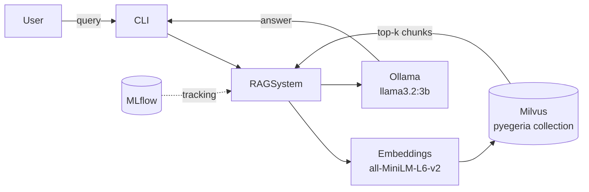
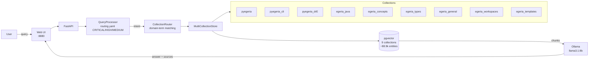
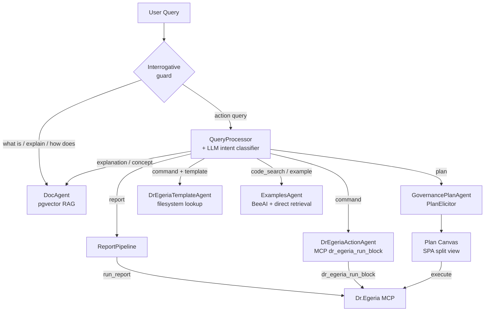
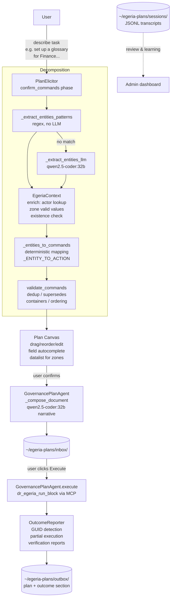

# Egeria Advisor — Project Summary: Phases, Capabilities, Lessons Learned

**Last updated:** 2026-06-13  
**Repository:** `/Users/dwolfson/localGit/egeria-v6/egeria-advisor`  
**GitHub:** `https://github.com/dwolfson/egeria-advisor`

---

## What the system is

A local RAG (Retrieval-Augmented Generation) system that provides intelligent assistance for [Egeria](https://egeria-project.org/) and pyegeria users. It runs entirely locally — Ollama for LLM inference, pgvector (PostgreSQL) for the vector store, sentence-transformers for embeddings. It connects to a live Egeria instance via Dr.Egeria MCP for report queries and command execution.

**Stack:**
- Python 3.12+, FastAPI, pgvector @ `localhost:5442`, Ollama @ `localhost:11434`
- Web UI: single-page app served by FastAPI @ `localhost:8880`
- ~88,900 indexed entities across 9 vector collections
- ~33,000 lines of Python

---

## Phase history

### Phases 1–4: Foundation (Jan–Feb 2026)
- Basic RAG pipeline, single `pyegeria` collection (Milvus backend)
- Ollama integration for local LLM inference (`llama3.2:3b` initially)
- MLflow experiment tracking; sentence-transformer embeddings (384-dim, all-MiniLM-L6-v2)
- Uniform ingestion: 1000-character chunks, 200-character overlap — same parameters for all content

### Phase 4b: Multi-collection infrastructure (Feb 18, 2026)
- First expansion: 3 Python collections introduced (`pyegeria`, `pyegeria_cli`, `pyegeria_drE`), each indexed from a separate source path within egeria-python
- `CollectionMetadata` dataclass in `advisor/collection_config.py` — source repo, paths, domain terms, include/exclude patterns, priority
- `CollectionRouter`: domain-term matching selects which collection(s) to search; weighted result merging (60% score / 25% collection quality / 15% priority)
- Java, docs, and workspaces collections (`egeria_java`, `egeria_docs`, `egeria_workspaces`) designed and registered but disabled — ready for Phase 2

### Phase 5: Agent framework (Feb 2026)
- BeeAI framework integration (later retained only for ConversationAgent)
- Multi-agent architecture established
- Key lesson: BeeAI `FunctionTool` objects have no `.func` attribute — extract implementations into `_raw()` plain functions

### Phase 5b: Phase 2 collections enabled (Feb 19, 2026)
- `egeria_java`, `egeria_docs`, `egeria_workspaces` indexed and enabled — 6 active collections total
- First signs that uniform parameters caused problems: documentation queries hallucinated because chunks were too small to hold a complete concept, and min\_score was too permissive for the broader doc content
- **Key realisation**: different content types need different retrieval behaviour. Code queries benefit from more results (higher top\_k); concept queries need precision (higher min\_score). This drove Phase 7 parameter tuning.

### Phase 6: CLI (Feb 2026)
- `egeria-advisor` CLI with `--interactive` and `--agent` modes
- `hey_egeria` CLI command lookup (`CLICommandAgent`)

### Phase 7: Prompt quality and intent-based routing (Feb–Mar 2026)
- **Problem**: routing accuracy ~60% — OMAS/OMAG/OMRS terms matched both Java code and documentation; "Dr. Egeria" variants weren't matched; substring collisions caused wrong-collection retrievals
- **Fix 1 — Domain term precision**: separated Java-specific terms from documentation terms; added all surface variants for collection names (spaces, hyphens, underscores, periods)
- **Fix 2 — Intent detection**: `CollectionRouter` gained intent keywords (`documentation`, `code`, `example`, `cli`) with priority boosts (+8–15 points) so a query phrased as "show me examples" routes to the examples collection even when the topic matches multiple collections
- **Fix 3 — Intent-classified prompts**: `prompt_templates.py` introduced 5 collection-specific system prompts and 9 query-type-specific instruction blocks — a code query and a concept query now receive different prompts even when routed to the same collection
- **Fix 4 — `routing.yaml`**: pattern-based pre-classifier (CRITICAL / HIGH / MEDIUM priorities) fires before any LLM call, routing obvious cases immediately
- Routing accuracy after fixes: 100% on 14-query test suite (up from ~60%)
- Perspective-aware prompting added: Developer / Data Engineer / Data Steward / Governance Officer — role-specific addendum injected into system prompt

### Phase 7b: Per-collection ingestion parameter tuning (Mar 2, 2026)
- `CollectionMetadata` gained four new fields: `chunk_size`, `chunk_overlap`, `min_score`, `default_top_k`
- Measured hallucination rate at ~80% on documentation queries with uniform 512-token chunks; root cause was chunks too small for tutorials (concept split mid-explanation) and min\_score too low for precise definitions
- **`egeria_docs` split** into three specialised collections, each tuned to its content type:
  - `egeria_concepts` — short concept definitions: chunk 768, overlap 150, min\_score 0.45 (highest in system), top\_k 5
  - `egeria_types` — type schemas and attribute tables: chunk 1024, overlap 200, min\_score 0.42, top\_k 6
  - `egeria_general` — tutorials and guides: chunk 1536, overlap 300, min\_score 0.38, top\_k 8
- Code collections kept at chunk 512 (functions fit naturally), overlap 100, min\_score 0.35, top\_k 10
- Java bumped to chunk 768 (methods are longer than Python functions)
- `egeria_workspaces` matched `egeria_general` parameters (narrative notebook content)
- After split and tuning: documentation hallucination rate fell from ~80% to ~27%
- Mar 8: Python ingestion switched from text chunking to AST-based parsing — functions and classes are now kept intact as natural chunk boundaries; docstrings stay with their methods

### Phase 8: Routing quality (Mar 2026)
- LLM intent classifier (`llm_intent_classifier.py`) introduced for queries that pattern-matching classifies as `general` — zero-temperature LLM call maps to LIVE_DATA / CODE_HELP / CONCEPT / WRITE_COMMAND / AMBIGUOUS
- `CODE_HELP` always maps to `code_search` intent even when the topic is a governance object (e.g. "give me Python to create a project" → ExamplesAgent, not DrEgeriaActionAgent)
- Role-aware routing in `_process_query`: Developer/Data Engineer + code signals → ExamplesAgent; Data Steward/Governance + ambiguous example signals (no Python keyword) → clarification asking whether they want Python code or a Dr.Egeria template
- Domain term conflicts (OMAS/OMAG/OMRS appearing in both code and docs) resolved by moving architecture acronyms to the documentation collections only

### Phase 9: Feedback and examples (Mar 2026)
- Thumbs up/down feedback capture
- ExamplesAgent: runnable Python examples + API reference (method-discovery mode)
- DrEgeriaTemplateAgent: template file lookup

### Phase 10: MCP integration and backend migration (Apr–May 2026)
- **Apr 25: Milvus → pgvector migration** — switched vector backend from Milvus (gRPC, separate process) to PostgreSQL + pgvector extension at `localhost:5442`; HNSW index replaces IVF_FLAT; `ThreadedConnectionPool` for concurrent queries; `_TABLE_NAME_MAP` added to handle collection name normalisation (e.g. `pyegeria_drE` → `pyegeria_dre`)
- **`egeria_templates` collection added** — Dr.Egeria markdown command templates indexed as a ninth collection from `egeria-python/sample-data/templates/`; deliberately tuned differently from all others: chunk 2048 (entire template in one chunk), overlap 0 (each file is self-contained), min\_score 0.30 (lowest in system — intent matching is fuzzy), priority 12 (highest)
- Dr.Egeria MCP server integration (`dr_egeria_run_block`, `run_report`)
- Report pipeline with `QuestionSpecIndex` semantic search over report specs
- DrEgeriaActionAgent: compose and execute multi-field Dr.Egeria commands
- Draggable sidebar resize handles in Web UI
- Admin dashboard with collection health, query metrics, feedback analysis, LGCI analytics

### Phase 11: LGCI — Literate Governance with Context Intelligence (Jun 2026)
See full design: `docs/literate-governance-plan.md`

The major new capability: describe a data management task in plain language → receive a complete, reviewable, executable Plan Document → execute it against Egeria → verified outcome report.

**Key components built:**

| Component | File | What it does |
|---|---|---|
| GovernancePlanAgent | `advisor/agents/governance_plan_agent.py` | Orchestrates the full plan lifecycle |
| PlanElicitor | `advisor/agents/plan_elicitor.py` | Multi-phase conversational Q&A |
| DraftManager | `advisor/governance_draft.py` | Persists in-progress sessions |
| DocumentManager | `advisor/governance_docs.py` | inbox/outbox lifecycle for plans |
| PlanTemplateManager | `advisor/plan_templates.py` | Reusable `{{placeholder}}` templates |
| ActionCatalog | `advisor/action_catalog.py` + `config/dr_egeria_actions.yaml` | 55 Dr.Egeria actions with rules |
| Plan validator | `advisor/plan_validator.py` | Deterministic post-processing rules |
| SessionLogger | `advisor/session_logger.py` | JSONL transcripts per session |
| ArtifactCanvas | `advisor/web/static/artifact_canvas.js` | Generic split-view canvas base |
| PlanCanvas | `advisor/web/static/plan_canvas.js` | Plan-specific canvas adapter |

**Flow:**
```
User describes task
  → PlanElicitor.start() → _decompose_intent (two-stage)
    → _extract_entities_patterns (regex, no LLM for common cases)
    → _extract_entities_llm (qwen2.5-coder:32b fallback)
    → _entities_to_commands (deterministic mapping)
    → validate_commands (dedup, supersedes, containers, ordering)
  → confirm_commands shown in chat + Plan Canvas opens
  → User confirms / adds / removes steps
  → generate → Plan Document saved to inbox
  → Execute → DrEgeriaActionAgent → Dr.Egeria MCP
  → OutcomeReporter → verification reports → outcome section
  → Plan moved to outbox
```

---

## Architecture evolution (Mermaid diagrams)

### Phases 1–4: Basic RAG



### Phase 4b–7: Multi-collection + routing



### Phase 8–9: Agent routing



### Phase 10–11: LGCI full lifecycle



### Phase 11c: Plan Editor mode

```mermaid
flowchart LR
    subgraph Entry points
        NL[Natural language\n"Set up a glossary..."] --> Elicitor[PlanElicitor\ndecompose intent]
        Builder["New Plan (Builder)\nknows Dr.Egeria commands"] --> Blank[Blank canvas\nbuilder_mode=true]
        Template[Saved template] --> Fill[Fill placeholders]
    end

    subgraph Command picker
        Blank --> Picker[Command Picker Modal\nsearch + family tabs]
        Picker -->|GET /api/actions| Index[CommandKeywordIndex\n55 catalogued\n~71 from templates\n126 total]
        Index --> Families["Collections / Data Designer\nGovernance Officer / Glossary\nProjects / Solution Architect\nDigital Product Mgr / ..."]
    end

    Elicitor --> Canvas[Plan Canvas]
    Blank --> Canvas
    Fill --> Canvas

    Canvas --> Execute[Same execution path\ndr_egeria_run_block MCP]
```

---

## Current capabilities

### Query / RAG
- **Explain** — conceptual answers from indexed Egeria docs (9 collections, ~88,900 entities)
- **Show me / Code** — runnable Python examples; API reference (ExamplesAgent)
- **Report** — live data from Egeria via MCP report specs (200+ reports)
- **Act** — Dr.Egeria command execution and template lookup
- **Plan** — LGCI multi-step plan generation (see above)
- **Troubleshoot** — debugging guidance

### Web UI (http://localhost:8880)
- Chat with markdown rendering, source citations, 👍/👎 feedback
- Left sidebar: Available Reports (grouped by topic), Plans (inbox/outbox), Active Drafts, Recent Queries
- Role selector (As:) — Anyone / Developer / Data Engineer / Data Steward / Governance
- Intent override (Auto / Explain / Show me / Report / Act / Plan / Troubleshoot)
- **Plan Canvas** — persistent split-view panel alongside chat when a plan is active:
  - Drag-to-reorder command cards
  - Expand cards for field editing (Basic/Advanced toggle)
  - Per-card narrative text (LLM-generated, user-editable)
  - Add / remove steps; Generate Plan / Execute buttons
  - Draggable ew-resize divider between chat and canvas
- Admin dashboard (`/admin`) — collection health, query analytics, feedback, LGCI plan usage

### Planning (LGCI)
- Describe any multi-object task in plain language
- Confirm proposed steps before any field elicitation
- Refine conversationally or directly in canvas (both live and in sync)
- Save/resume drafts between sessions (persisted to `~/egeria-plans/drafts/`)
- Save approved plans as reusable templates
- Execute → outcome reports appended → moved to outbox
- Session transcripts saved to `~/egeria-plans/sessions/` for review and learning

---

## Model routing

| Use case | Model | Why |
|---|---|---|
| RAG Q&A, routing, embeddings context | `llama3.1:8b` | Speed — high-volume path |
| Planning: narrative, refinement, change application | `qwen2.5-coder:32b` | Quality — better instruction following at 32B |
| Code examples, code analysis | `codellama:13b` | Code-focused |
| Embeddings | `sentence-transformers/all-MiniLM-L6-v2` | Fixed, not via Ollama |

Configuration: `config/advisor.yaml` → `llm.models.{query|planning|code}`.  
Planning code calls `get_planning_llm()`, not `get_ollama_client()`.

---

## Key lessons learned

### 1. Local 8B models can't follow complex JSON instructions reliably

Asking llama3.1:8b to emit structured command JSON caused it to:
- Copy example values ("Analysis", "Discovery") instead of extracting the user's text
- Repeat commands 3–4 times
- Hallucinate governance zones and project hierarchies not mentioned by the user

**Fix:** Two-stage extraction — patterns first (no LLM), deterministic mapping second. The LLM only extracts names and entity types; it never decides command structure.

### 2. Deterministic rules beat prompt engineering for structural correctness

Every structural rule embedded in a prompt is a rule that a small model may ignore. Rules that belong in code (dedup, container ordering, self-referential parent IDs) should be in the validator, not the prompt.

**Fix:** `plan_validator.py` with 6 deterministic post-processing rules applied after every decomposition. The validator is the safety net; the prompt is the starting point.

### 3. Generate first, interrogate second

Slot-filling chatbots that ask multiple questions before showing anything have poor completion rates. Users disengage after 3–4 sequential questions.

**Fix:** `confirm_commands` phase — show the proposed steps immediately, let the user react. Only ask for details after the shape of the plan is confirmed.

### 4. Conversation handles structure; canvas handles detail

Structural changes ("add a sub-project", "remove step 3", "move design before requirements") are natural in conversation. Field-level detail (descriptions, dates, owners) is better handled by clicking a field in a visible artifact.

**Fix:** Side-by-side Plan Canvas + chat. Neither forces the user into the other mode.

### 5. Dr.Egeria sub-projects don't use Link Project Hierarchy

Sub-projects are created using `Create Project` with `Parent ID` and `Parent Relationship Type Name = ProjectHierarchy` — a single command. `Link Project Hierarchy` is never needed and was causing validator warnings.

**Fix:** Added to action catalog as a superseded action; validator converts it automatically.

### 6. BeeAI FunctionTool objects have no .func attribute

Calling `my_tool.func(...)` raises `AttributeError`. Extract implementations into `_raw()` functions.

### 7. The action catalog is the right place for structural knowledge

55 Dr.Egeria actions (out of ~126 unique commands across 12 template families) with their ordering priorities, container dependencies, supersedes relationships, and natural-language aliases. This is the system's "learned rules" — structured, inspectable, and evolvable without touching the LLM or prompts. Actions not yet in the catalog are still accessible via the Plan Editor (direct builder) mode through the command keyword index.

### 9. Intent override is a suggestion, not a mandate

Treating intent=Plan as an absolute mandate caused "What is a Dr.Egeria Template?" to enter the planning agent and attempt to create a glossary term for it. A pre-flight interrogative guard fires before intent is applied: `what is`, `how does`, `explain`, `define`, etc. always route to DocAgent regardless of what intent is set.

### 10. Build the action catalog from real use cases, not upfront coverage

The catalog grew to 42 entries by adding entries only when scenarios were tested. This left entire families (Solution Architect, most of Governance Officer) missing. When a user asked "Create a blueprint called X", the system defaulted to "Create Project". The fix requires both a complete command keyword index (built from the template filesystem) and a systematic catalog expansion pass — not just adding entries reactively.

### 8. Model routing significantly improves quality without full model switch

Using a 32B model for narrative generation / refinement while keeping 8B for high-volume Q&A gives much better plan document quality without sacrificing RAG latency.

---

## Architecture overview (current)

```
User (Web UI @ localhost:8880)
  → FastAPI (advisor/web/app.py)
  → RAGSystem (advisor/rag_system.py)
      ├─ Draft routing (draft_id present → PlanElicitor)   [fires first]
      ├─ Template/resume navigation patterns
      ├─ Interrogative guard (what is/how does/explain → DocAgent, overrides intent)
      ├─ QueryProcessor → intent classifier → route to agent/pipeline
      │     └─ if intent override set (plan/command/act) but query is interrogative
      │          → override redirected to 'explanation' before classifier fires
      │
      ├─ plan              → GovernancePlanAgent → PlanElicitor → Plan Canvas
      │     ├─ confirm_commands: restart_signals → fresh description
      │     └─ keyword_suggestions → "Did you mean X?" in confirm
      ├─ report            → ReportPipeline → MCP run_report
      ├─ command (+template) → DrEgeriaTemplateAgent (filesystem)
      ├─ command           → DrEgeriaActionAgent → MCP dr_egeria_run_block
      ├─ code_search/example → ExamplesAgent (BeeAI + direct retrieval)
      ├─ explanation/etc   → DocAgent
      └─ fallback          → RAG retrieval → pgvector → LLM generation

Plan Editor (builder mode):
  POST /api/drafts/builder → blank draft (builder_mode=True)
  GET  /api/actions        → all ~126 commands grouped by family
  → Plan Canvas opens; user searches/picks commands via command picker modal
  → same canvas + execution path as conversational mode
```

**Vector collections (9 active, ~88,900 entities):**
`pyegeria`, `pyegeria_cli`, `pyegeria_drE`, `egeria_java`, `egeria_concepts`,
`egeria_types`, `egeria_general`, `egeria_workspaces`, `egeria_templates`

---

## File structure (key files)

```
advisor/
  rag_system.py              — main orchestrator; interrogative routing guard
  query_processor.py         — pattern-match classifier
  llm_client.py              — OllamaClient + get_planning_llm()
  config.py                  — Pydantic config models
  action_catalog.py          — ActionCatalog (55 actions)
  command_keyword_index.py   — CommandKeywordIndex: all ~126 commands, 4-tier confidence lookup
  plan_validator.py          — validate_commands() — 6 deterministic rules
  governance_draft.py        — DraftManager
  governance_docs.py         — DocumentManager
  plan_templates.py          — PlanTemplateManager
  session_logger.py          — SessionLogger (JSONL transcripts)
  egeria_context.py          — EgeriaContext: live actor/project/zone lookups
  agents/
    governance_plan_agent.py — GovernancePlanAgent (two-stage extraction + keyword index)
    plan_elicitor.py         — PlanElicitor (confirm→generate→refine + restart path)
    dr_egeria_agent.py       — DrEgeriaActionAgent
    dre_template_agent.py    — DrEgeriaTemplateAgent
    examples_agent.py        — ExamplesAgent
    doc_agent.py             — DocAgent
    outcome_reporter.py      — OutcomeReporter (partial execution detection)
  web/
    app.py                   — FastAPI routes (incl. /api/actions, /api/drafts/builder)
    static/
      index.html             — SPA (command picker modal, builder entry)
      plan_canvas.js         — PlanCanvas adapter
      artifact_canvas.js     — ArtifactCanvas base (addItem → command picker)
      plan_editor.js         — Plan Editor (full-document view)
      auth.js                — JWT auth helper
config/
  advisor.yaml               — primary config (llm models, paths, rag params)
  dr_egeria_actions.yaml     — action catalog (55 actions, 10 families)
  governance_report_map.yaml — family → report_spec mapping
  routing.yaml               — query classification patterns
docs/
  literate-governance-plan.md — LGCI design (v5, comprehensive)
  user-docs/
    LITERATE_GOVERNANCE_GUIDE.md — LGCI user guide
    QUICK_START.md               — Getting started
```

---

## Recent work (Jun 2026)

### Phase 11c — Routing fixes + Plan Editor mode (Jun 13, 2026)

**Action catalog gap analysis and expansion** ✓ (commit 4412ff5)
- Identified that the catalog covered only 42 of ~126 unique Dr.Egeria commands — one-third
- Dr.Egeria provides 253 template files in basic/advanced pairs across 12 families; the catalog was built reactively, leaving entire families absent
- Added **Solution Architect** family (13 commands: Create Solution Blueprint, Create Solution Component, Create Solution Role, Create Information Supply Chain, and 9 Link commands) — catalog grows from 42 → 55
- Wired `solution_blueprint`, `solution_component`, `information_supply_chain`, `solution_role` into `_ENTITY_TO_ACTION` and `_infer_type_from_context()` — fixes "blueprint" and "component" defaulting to "Create Project"

**Routing defect fixes** ✓ (commit 4412ff5)
- **Negative routing guard** — `_INTERROGATIVE_PREFIXES` constant + `_is_interrogative()` method in `rag_system.py`; fires before intent override is applied; "What is X?" with intent=Plan now routes to DocAgent instead of entering the plan agent
- **Intent override semantics** — guard priority documented: interrogative check > draft_id routing > intent override > pattern classifier
- **Dr.Egeria Explain routing** (Issue 4) — `routing.yaml` explanation patterns expanded with all "what is a dr egeria template" and "what are dr egeria templates" variants; `egeria_general` and `pyegeria_drE` domain terms extended to include "dr egeria template" keywords so DocAgent selects the right collections
- **Show Me routing** (Issue 5) — "show me a dr egeria template" and related forms added to CRITICAL command patterns in `routing.yaml`; routes to `DrEgeriaTemplateAgent` instead of `ExamplesAgent`

**Command keyword index** ✓ (commit e57625f)
- New `advisor/command_keyword_index.py` — `CommandKeywordIndex` class
- Builds from catalog aliases (0.95 confidence) + catalog command names (0.90) + template filesystem scan of all ~126 commands (0.75) + partial substring matching (0.55)
- `lookup(phrase) → CommandMatch(command, family, confidence, source)` — used in `_infer_type_from_context()` as last resort before defaulting to "project"
- `all_commands()` returns full catalog + uncatalogued templates grouped by family — powers `/api/actions` endpoint
- Replaces the blind `"Create Project"` fallback for unknown entity types

**Confidence-gated clarification** ✓ (commit e57625f)
- Low-confidence entity type inferences (confidence < 0.80) are flagged and threaded through `_decompose_intent()` → `PlanElicitor.start()` → stored in draft spec
- `_build_confirm_commands_response()` surfaces "⚠️ I interpreted **\"X\"** as **Create Solution Blueprint** — if that's not right, describe what you meant" warnings when type was inferred with low confidence

**"Completely wrong" correction path** ✓ (commit e57625f)
- New `restart_signals` block in `_handle_confirm_commands()`: "completely wrong", "totally wrong", "not what I asked", "start over", "misunderstood", etc.
- Clears command list, prompts fresh description — full restart without leaving the draft
- `correction_signals` hint updated to mention "completely wrong" as an option

**Plan Editor mode** ✓ (commit e57625f)
- `POST /api/drafts/builder` — creates blank draft with `builder_mode: True`; bypasses `_decompose_intent()`
- `GET /api/actions` — returns all ~126 commands grouped by family for the picker UI
- "New Plan (Builder)" button in Plans sidebar header
- Builder title modal → creates blank canvas
- **Command picker modal**: search input + family filter tabs + command cards with "Add" button; replaces `prompt()` in `addItem()`; `artifact_canvas.js` opens the picker when available

### Phase 11b — LGCI quality + Egeria integration (Jun 10–11, 2026)

**User Login / Authentication** ✓ (commit 47513aa)
- JWT-based auth (HS256, 8-hour TTL, `PyJWT 2.12.1`)
- Login overlay in Web UI; anonymous RAG mode (knowledge/code/plan generation work without login)
- Auth gates in `rag_system.py` — reports, command execution, and plan execution require active session
- Portal SSO design: shared-secret token exchange via postMessage (iframe) and URL fragment (new tab)
- `advisor/auth.py` + `advisor/web/static/auth.js`; all fetch calls updated with `Auth.getHeaders()`

**Admin transcript viewer** ✓ (commit 0605156)
- `admin.html`: Plan Sessions section — outcome-badged table listing all JSONL sessions
- Transcript modal with failure highlighting: amber for confused system turns ("I wasn't sure…"), red for user correction turns ("I asked to…", "not a project")
- Wired into auto-refresh cycle

**Pattern library expansion** ✓ (commit 0605156)
- `_extract_entities_patterns`: added task, team, agreement, data-sharing-request entity types
- `_ROLE_PATTERNS`: added "have X be the Y" and "role as X" phrasings
- `_NAME_STOP`: stops at spaced dashes and the word "have"
- `_infer_type_from_context`: covers all 9 entity types (including study_project, personal_project, agreement)
- `_ENTITY_TO_ACTION`: added `data_sharing_request` / `data_sharing_agreement` → `Create Agreement`

**Egeria context enrichment for planning** ✓ (commits 6192a66, 85ffcf8)
- New `advisor/egeria_context.py` — `EgeriaContext` wraps ActorManager, ProjectManager, GovernanceOfficer, GlossaryManager; lazy init, graceful offline fallback, per-instance zone cache
- Stage 1b in `_decompose_intent`: resolves person names (e.g. "Tom Tally") to Egeria Actor profile qualified names; injects `Actor Profile Qualified Name` into `Link Person Role Appointment` pre_filled fields
- Existence check: warns when a named project/glossary already exists in Egeria
- Governance zone valid values: `/api/templates/{cmd}/fields` injects live zone names as autocomplete options for zone fields; canvas renders `<datalist>` suggestions
- New `/api/egeria/zones` endpoint

**Partial execution detection** ✓ (commit 1363a44)
- `OutcomeReporter.generate()` now accepts `expected_command_count` (auto-counted from plan's Command Sequence section)
- GUID regex detects object-creation successes even when Dr.Egeria doesn't echo "success"
- Status correctly infers Partial when fewer GUIDs returned or fewer command blocks found than expected
- Outcome header shows "N of M commands processed (K succeeded)"

---

## Current state and next steps (Jun 2026)

**LGCI phases complete:**
- Phase 1 ✓ — canvas, conversational planning, confirm→generate→refine flow
- Phase 2 ✓ — execution, outcome reporter, partial execution detection
- Phase 3 partial — ArtifactCanvas extracted; Report Spec canvas needs design
- Phase 11b ✓ — auth, pattern library, Egeria context enrichment, zone valid values
- Phase 11c ✓ — routing fixes, catalog expansion, keyword index, plan editor

**Planned next (in priority order):**

- **Action catalog expansion (Phase 4C)** — the catalog covers 55 of ~126 unique commands. Phase 4C adds the remaining ~71 to enable *conversational* planning across all Dr.Egeria families. Priority order: Collections (15), Solution Architect Link commands (8 remaining), Governance Officer Create commands (~27 remaining), Data Designer (11 remaining), Digital Product Manager (8 remaining). ⚠️ Verify field names against Dr.Egeria template files before writing entries.

- **Egeria Projects & Tasks** — fill specific catalog gaps for the 0130-Projects type system: Update Project, Update Task, Add Project Team Member, Classify Project as Experiment; add `known_fields` (mission, successCriteria, projectStatus, projectHealth, priority, dates) to existing Create actions; routing patterns for project/task listing; report specs for Campaigns, Tasks.

- **Egeria referenced data for valid field values** — `ReferenceDataManager` for project status, data classification levels, etc.; extend `EgeriaContext.find_valid_values(set_name)` and wire into the fields endpoint for field types beyond governance zones.

- **Egeria Actor lookup for unresolved names** — when `actor_found=False`, optionally auto-insert a `Create Actor Profile` command before the role appointment. Currently surfaces a warning only.

- **Few-shot examples from approved plans** — index past approved plans into a new pgvector collection; retrieve similar plans during `_decompose_intent` to improve narrative generation for recurring task types.

- **Report Spec canvas** — create/edit question_specs via chat + canvas (needs design session).

- **MCP credential propagation** — investigate whether `run_report`/`dr_egeria_run_block` accept per-call user args; if yes, thread JWT-extracted credentials through to MCP.

- **Builder mode chat routing** — when `builder_mode: True` is set on a draft, informational chat queries should route to DocAgent rather than GovernancePlanAgent (currently not yet implemented — the flag is stored but not yet read by `_process_query`).

- **Multi-user considerations** — the system is currently single-user (OS user identity, one set of Egeria credentials, shared pgvector). Multi-user raises questions across several layers: (1) *Auth* — JWT already in place; Egeria credentials per-user would require per-session MCP processes or credential injection into tool calls; (2) *Isolation* — plan drafts and session transcripts currently sit in `~/egeria-plans/`; multi-user needs per-user directories or a shared store keyed on user ID; (3) *Egeria permissions* — each user may have different Egeria access rights; the system currently uses a service account; (4) *Vector store* — the indexed collections are shared (public Egeria documentation + code), which is fine; only the plan artifacts and live-data queries are user-specific; (5) *Session state* — `_activeDraftId` is in `sessionStorage` (per-browser-tab), which is already per-user in practice. Recommend: defer full multi-user until the Portal integration (shared-secret SSO) is in place, since the Portal defines the auth boundary.

- **Docker deployment** — the system has four external dependencies (pgvector, Ollama, Dr.Egeria MCP, Egeria itself) that a Docker Compose setup would need to manage. Key considerations: (1) Ollama GPU passthrough requires `--gpus all` and is Linux-only natively (macOS runs Ollama outside Docker); (2) pgvector can be `ankane/pgvector` image; (3) the Advisor itself is straightforward to containerize; (4) Dr.Egeria MCP and Egeria require separate containers or external hosts; (5) volume mounts for `~/egeria-plans/` and the vector store data. A minimal Compose file would cover: advisor + pgvector + Ollama (or point to external). Full environment including Egeria server is more complex and likely out of scope for the first Docker pass.

- **IntentModel** (deferred) — formal intermediate representation between extraction and command mapping.

---

## How to resume in a new conversation

1. Read `CLAUDE.md` — full maintenance context, design rules (13–19 for LGCI)
2. Read `docs/literate-governance-plan.md` — complete LGCI design including lessons
3. Read `docs/PROJECT_SUMMARY.md` (this document) for overall phase history
4. Run `git log --oneline -10` to see recent commits
5. Start the web UI: `python -m advisor.web.app` → `http://localhost:8880`
